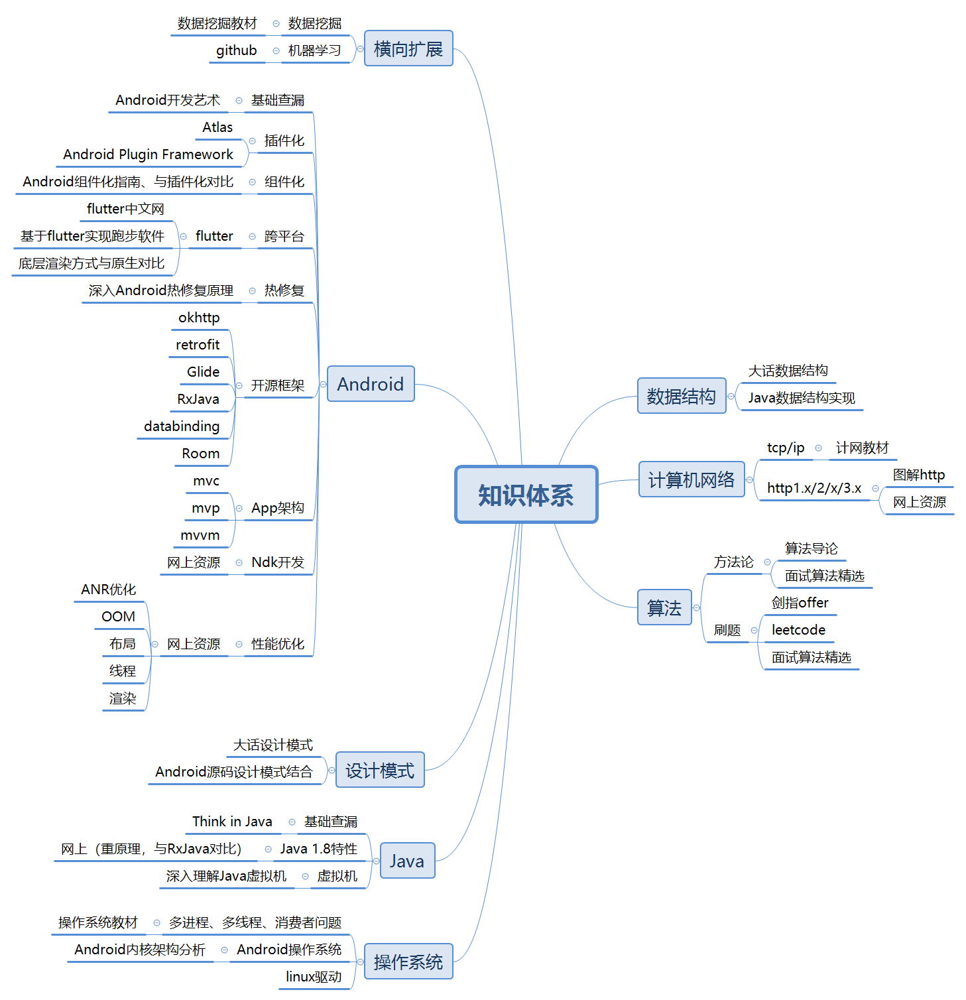

# James-Github.io

## About
以后知识体系、文章、笔记相关的东西都放这里啦

目前的学习路线, 以后再慢慢完善吧~

## 数据结构

## 设计模式

## 计算机网络

## 算法
* 动态规划：[关于动态规划的方法论与例题](https://github.com/IaMJamesHuang/Github.io/blob/master/algorithm/%E5%8A%A8%E6%80%81%E8%A7%84%E5%88%92.md)
* 贪心算法：[关于贪心算法的方法论与例题](https://github.com/IaMJamesHuang/Github.io/blob/master/algorithm/%E8%B4%AA%E5%BF%83%E7%AE%97%E6%B3%95.md)
## 操作系统

## Java
* 动态代理：[Java动态代理机制分析](https://github.com/IaMJamesHuang/Github.io/blob/master/java/%E5%8A%A8%E6%80%81%E4%BB%A3%E7%90%86.md)

## Android
* 热修复：[Android热修复技术漫谈](https://github.com/IaMJamesHuang/Github.io/blob/master/android/%E7%83%AD%E4%BF%AE%E5%A4%8D.md)
* android注解：[Android通过注解实现动作追踪注入框架](https://github.com/IaMJamesHuang/Github.io/blob/master/android/%E6%B3%A8%E8%A7%A3.md)
* databinding：[databinding学习笔记](https://github.com/IaMJamesHuang/Github.io/blob/master/android/databinding.md)
* Android架构组件：[VIewModel和LiveData学习笔记](https://github.com/IaMJamesHuang/Github.io/blob/master/android/viewmodel.md)

## 横向扩展