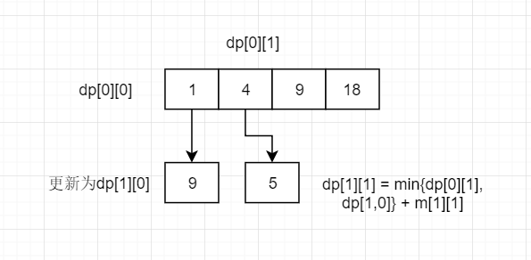
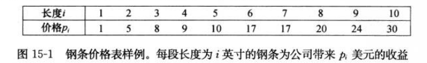

# 动态规划
动态规划与分治法相似，都是通过组合子问题的解来求解原问题。但不同的是，分治法是将问题分为互不相交的子问题，递归求解，再组合他们的解，从而得到原问题的解。与之相反，动态规划主要应用于子问题重叠的情况，其对相同的子问题只求解一次，从而无需每次求解一个子问题都重新计算，是一种**空间换时间**的思想。

动态规划方法通常用来求解**最优解问题**。这类问题通常有许多可行解，同时有不只一个解能达到最优值，而动态规划往往只是找到其中一个最优解。

下面结合一个例子来说明动态规划的应用过程：
## 矩阵的最小路径和
【题目】给定一个矩阵m，从左上角开始每次只能向右或者向下走，最后到达右下角的位置，路径上的所有数据累加起来就是路径和，返回所有的路径中最小的路径和。

【举例】如果给定的m如下：

```
1 3 5 9
8 1 3 4
5 0 6 1
8 8 4 0
```
路径1，3，1，0，6，1，0是所有路径中路径和最小的，所以返回12。

【解答】由于使用动态规划来求解的子问题往往需要保存子问题的解，从而为其他子问题的求解节约时间，所以这里定义一个二维数组：
```
假设矩阵m的大小为MxN，定义大小与矩阵相同的二维数组dp[M][N]，其中dp[i][j]的值表示从左上角（0，0）位置走到（i，j）位置的最小路径和。
```
由于整个矩阵只能向下或者向右走，所有除了第一行和第一列的其他位置（i，j）外，都有左边位置（i-1，j）和上边位置（i，j-1），那么可以得出：
```
db[i][j] = min{dp[i-1][j],dp[i][j-1]} + m[i][j]
```
其含义是比较从（0，0）位置开始，经过（i-1，j）到达（i，j）和经过（i，j-1）到达（i，j）的最小路径之间，哪条路径的路径和最小，其最小的一个，就是d[i][j]的值，即到[i][j]的最小路径和。此即**最优解值**的递归定义。

接下来解析计算最优解的过程：

对于第一行，从（0，0）到（0，j）只能往右走，所以到（0，j）的路径和dp[0][j]就是第一行的路径值m[0][0..j]的累加之和。同理可求得第一列的路径和。
```
1 4 9 18
9
14
22
```
而剩余的值，可以由上述的最优解递推式得出：
```
1  4  9  18
9  5  8  12
14 5  11 12
22 13 15 12
```
下面是具体的代码实现：
```
    public int minPathSum(int[][] m) {
        if (m == null || m.length == 0 || m[0] == null || m[0].length == 0) {
            return 0;
        }
        int row = m.length;
        int col = m[0].length;
        int[][] dp = new int[row][col];
        dp[0][0] = m[0][0];
        //dp的第一个纵向值
        for (int i = 1; i < row; i++) {
            dp[i][0] = dp[i-1][0] + m[i][0];
        }
        //dp的第一个横向值
        for (int j = 1; j < col; j++) {
            dp[0][j] = dp[0][j-1] + m[0][j];
        }
        //根据递推式求解
        for (int i = 1; i < row; i++) {
            for (int j = 1; j < col; j++) {
                dp[i][j] = Math.min(dp[i-1][j], dp[i][j-1]) + m[i][j];
            }
        }
        return dp[row-1][col-1];
    }
```
不难看出，以上算法的时间复杂度为O(MxN)，空间复杂度为O(MxN)
## 空间压缩
上面的算法其实并不完美，其经过空间压缩后空间复杂度可以达到O(min{M,N})。而空间压缩的实现则是在上面的基础上，只采用一个一维数组来存储子问题的解，而不是二维数组。具体过程如下：
* 生成一个长度为4的数组arr[]，一开始，其含义表示为从（0，0）到（0，j）位置的最小路径和，所以可以得到，其初始值为：
    ```
    arr = [1, 4, 9, 18]
    ```
* 在这一步中，将arr[j]的含义改变为从（0，0）到（1，j）的最小路径和。首先来看arr[0]，更新前的arr[0]表示从（0，0）位置到达（0，0）位置的最小路径和，要将其改变为从（0，0）到（1，0）的最小路径和只需要令arr[0] = arr[0] + m[1][0] = 9即可。然后来看arr[1]，更新之前arr[1]的值代表（0，0）到（0，1）的最小路径和，要将其改变为（0，0）到（1，1）的最近路径和。根据上面的求解过程，到达（1，1）的位置有两种可能，一种是从（1，0）位置到达（1，1），另一种是从（0，1）位置到达（1，1）。其最小路径和应该是这两者中最小的一个。而此时arr[0]的值已经被更新为dp[1][0]的值（即到（1，0）的最小路径和），但是arr[1]的值仍然是dp[0][1]的值，所以根据可以得出新的arr[1] = min{arr[0], arr[1]} + m[1][1] = 5。同理可以得出arr[2] = min{arr[1], arr[2]} + m[1][2]...

    

* 重复上一步的更新过程，直到arr彻底变为dp矩阵的最后一行。整个过程其实就是不断滚动更新arr数组，让arr依次变为dp矩阵每一行的值，最终变成dp矩阵最后一行的值，即
    ```
    arr = [9, 5, 8, 12]
    ```
如果给定矩阵的行数小于列数（M<N），也可以生成长度为M的arr，使得arr的值依次更新为dp矩阵的每一列的值，也同样可以得到最后的结果。

下面是具体的代码实现：
```
    public int minPathSum2(int[][] m) {
        if (m == null || m.length == 0 || m[0] == null || m[0].length == 0) {
            return 0;
        }
        int more = Math.max(m.length, m[0].length);
        int less = Math.min(m.length, m[0].length);
        boolean rowmore = more == m.length; //行数是否大于列数
        int[] arr = new int[less];
        arr[0] = m[0][0];
        for (int i = 1; i < less; i++) {
            arr[i] = arr[i-1] + (rowmore ? m[0][i] : m[i][0]);
        }
        for (int i = 1; i < more; i++) {
            arr[0] = arr[0] + (rowmore ? m[i][0] : m[0][i]);
            for (int j = 1; j < less; j++) {
                arr[j] = Math.min(arr[j - 1], arr[j]) + (rowmore ? m[i][j] : m[j][i]);
            }
        }
        return arr[less - 1];
    }
```
一般来说，需要二维动态规划表的题目都可以使用空间压缩的办法减小空间复杂度。
## 其他例题
### 钢条切割
给定一段长度为n英寸的钢条和一个价格表pi(i=1,2,…n)，求切割钢条方案，使得销售收益rn最大。注意，如果长度为n英寸的钢条的价格pn足够大，最优解可能就是完全不需要切割。下面是一个价格表样例：

【自顶向下的递归解法】可以将问题分解为：将长度为n的钢条分解为左边开始一段，以及剩余部分继续分解的结果。不做任何切割的方案即0-n分。记收益为r，可以得到递推式：
```
r(n) = max(p[i] + r[n-1])，其中1<=i<=n
```
以下是具体的代码实现：
```
    public static int steelCut(int[] p, int n) {
        if ( n == 0) {
            return 0;
        }
        int result = -1;
        for (int i = 0; i < n; i++) {
            result = Math.max(result, p[i] + steelCut(p, n - i -1));
        }
        return result;
    }
```
自顶向下的递归解放虽然过程清晰，但是由于分解的子问题是有部分重叠的，所以递归的实现其效率并不高。

【动态规划】动态规划适合于解决子问题重叠的情况，下面展示自顶向下和自底向上两种解决方法。

【带备忘录的自顶向下的递归解法】可以创建一个一维数组arr来存储子问题的最优解，在递归过程中，如果需要用到，直接从数组中取，不需要重复计算。

以下是具体的代码实现：
```
    public int steelCut2(int[] p, int n) {
        int[] arr = new int[n];
        for (int i = 0; i < n ;i++) {
            arr[i] = -1;
        }
        return subSteelCut2(p, n, arr);
    }

    public int subSteelCut2(int[] p, int n, int[] arr) {
        if (n == 0) {
            return 0;
        }
        if (arr[n-1] >= 0) {
            return arr[n-1];
        }
        int result = -1;
        for (int i = 0; i < n; i++) {
            result = Math.max(result, p[i] + subSteelCut2(p, n - i -1, arr));
        }
        arr[n-1] = result;
        return result;
    }
```
【自底向上的解法】自底向上的解法与上面的带备忘录的自顶向下的解法思路是一致的，只是使用迭代，从0开始计算子问题，并保存相应的解，以面重复计算。

以下是具体的实现：
```
    public static int steelCut3(int[] p, int n) {
        int[] arr = new int[n + 1];
        arr[0] = 0;
        //依次求解子问题，直到规模达到n
        for (int i =1 ; i < arr.length; i++) {
            int result = -1;
            for (int j = 1; j < i + 1; j++) {
                result = Math.max(result, p[j-1] + arr[i - j]);
            }
            arr[i] = result;
        }
        return arr[arr.length - 1];
    }
```

### 换钱的最少货币数
【题目】给定数组arr,arr中所有的值都为正数且不重复。每一个值代表一种面值的货币，再给定一个整数n，代表要找的钱数，求组成n的最少货币数

【自顶向下递归】可以将问题分解为，使用a张arr[0]货币后，再用b张arr[1...arr.length-1]货币组成n，选取其中的最小值。其中a=0表示不使用当前货币。随后递归求解b张arr[1...arr.length-1]货币组成n-a*arr[0]的值

以下是具体的代码实现：
```
 public static int getMinWay(int[] arr, int n, int from, int to) {
        if (arr == null || arr.length == 0 || n < 0) {
            return -1;
        }
        if (n == 0) {
            return 0;
        }
        if (from > to) {
            return -1;
        }
        int count = 0;
        int min = Integer.MAX_VALUE;
        while (count * arr[from] <= n) {
            int result = getMinWay(arr, n - count * arr[from], from + 1, to);
            if (result == -1) {
                count++;
                continue;
            }
            min = min > result + count ? result + count : min;
            count++;
        }
        if (min == Integer.MAX_VALUE) {
            return -1;
        }
        return min;
    }
```

【带备忘录的自顶向下】可以用一个二维数组db[arr.length][n+1]存储子问题的解，其中db[i][j]表示使用arr[i...arr.length-1]组成j的最小钱币数。

以下是具体的代码实现：
```
 /*
     * 带备忘录
     * arr={5,2,3} n=15
     * 10,5
     * 10,5
     */
    public static int getMinWay2(int[] arr, int n) {
        //db[i][j]表示用arr[i..arr.length-1]凑成n的最小钱币数
        int[][] db = new int[arr.length][n + 1];
        for (int i = 0; i < db.length; i++) {
            for (int j = 0; j < db[0].length; j++) {
                db[i][j] = Integer.MAX_VALUE;
            }
        }
        db[0][0] = 0;
        return getMinWaySub(arr, n, 0, arr.length -1, db);
    }

    public static int getMinWaySub(int[] arr, int n, int from, int to, int[][] db) {
        if (arr == null || arr.length == 0 || n < 0) {
            return -1;
        }
        if (n == 0) {
            return 0;
        }
        if (from > to) {
            return -1;
        }
        int count = 0;
        int min = Integer.MAX_VALUE;
        while (count * arr[from] <= n) {
            int result = db[from][n];
            if (result == Integer.MAX_VALUE) {
                result = getMinWay(arr, n - count * arr[from], from + 1, to);
            }
            if (result == -1) {
                count++;
                continue;
            }
            min = min > result + count ? result + count : min;
            count++;
        }
        int value = min == Integer.MAX_VALUE ? -1 : min;
        db[from][n] = value;
        return value;
    }
```

【自底向上的动态规划】与带备忘录的自顶向下类似，这里使用一个二维数组db[arr.length][n+1]存储子问题的解，不同的是，这里db[i][j]的含义是使用arr[0...i]组成j的最小钱币数目。

以下是具体的代码实现：
```
 /*
     * 自底向上
     */
    public static int getMinWay3(int[] arr, int n) {
        if (arr == null || arr.length == 0 || n <0) {
            return -1;
        }
        if (n == 0) {
            return 0;
        }
        //db[i][j]表示使用arr[0...i]组成j的最小钱币数目
        int[][] db = new int[arr.length][n+1];
        db[0][0] = 0;
        //求db第一行的值
        for (int i = 1; i < db[0].length; i++) {
            int r = i % arr[0];
            if (r == 0) {
                db[0][i] = i / arr[0];
            } else {
                db[0][i] = Integer.MAX_VALUE;
            }
        }
        //求db第一列的值
        for (int i = 1; i <db.length; i++) {
            db[i][0] = 0;
        }
        //迭代求其他
        //横向 a[i][1..j]
        int left = 0;
        for (int i = 1; i < db.length; i++) {
            for (int j = 1; j < db[0].length; j++) {
                left = Integer.MAX_VALUE;
                if (j - arr[i] >=0 && db[i][j - arr[i]] != Integer.MAX_VALUE) {
                    left = db[i][j-arr[i]] + 1; //使用 2、3、4张arr[i]的情况已经在前面求得了
                }
                db[i][j] = Math.min(left, db[i - 1] [j]);
            }
        }
        return db[db.length - 1][db[0].length - 1];
    }
```

【动态规划的空间压缩】一般来说，空间压缩适用于所有使用二维数组存储子问题的解的动态规划问题。对于本题，生成一个长度为n+1的数组db，然后按照滚动行的方式来更新db的信息。之所以选用按行更新，是因为递推公式**db[i][j]=min{db[i-1][j],dp[i][j-arr[i]]+1}**,db的更新依赖数组左边的值和上面的值，所以按行更新只需要一个一维数组，而按列更新的情况比较复杂。

以下是具体的代码实现：
```
    /*
     * 空间压缩
     */
    public static int getMinWay4(int arr[], int n) {
        if (arr == null || arr.length == 0 || n < 0) {
            return -1;
        }
        int[] db = new int[n + 1];
        //求db第一行的值
        db[0] = 0;
        for (int i = 1; i < db.length; i++) {
            int r = i % arr[0];
            if (r == 0) {
                db[i] = i / arr[0];
            } else {
                db[i] = Integer.MAX_VALUE;
            }
        }
        //求剩下的值
        int left = 0;
        for (int i = 1; i < arr.length; i++) {
            for (int j = 1; j < n + 1; j++) {
                left = Integer.MAX_VALUE;
                if (j - arr[i] >=0 && db[j - arr[i]] != Integer.MAX_VALUE) {
                    left = db[j - arr[i]] + 1;
                }
                db[j] = Math.min(left, db[j]);
            }
        }
        return db[n] != Integer.MAX_VALUE ? db[n] : -1;
    }
```