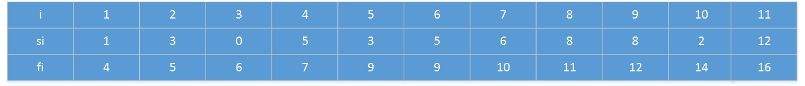
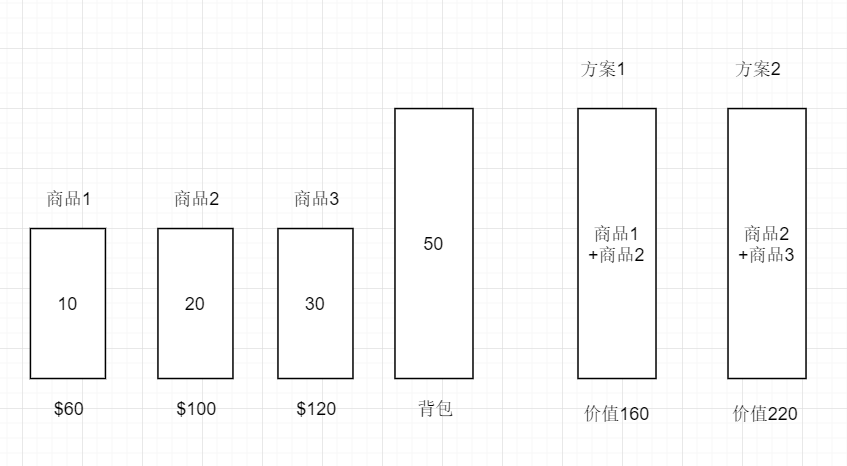

# 贪心算法
贪心算法（又称贪婪算法）是指，在对问题求解时，总是做出在当前看来是最好的选择。也就是说，不从整体最优上加以考虑，他所做出的是在某种意义上的局部最优解。

贪心算法不是对所有的问题都能取得全局的最优解，关键是贪心策略的选择，选择的贪心策略必须具备无后效性，即某个状态以前的过程不会影响以后的状态，只与当前状态有关。

简单的来说，贪心算法适用的前提是：局部最优解能组合产生全局最优解。

下面结合一个例子来说明贪心算法的应用过程：

## 活动选择问题
【题目】 假定一个有n个活动(activity)的集合S={a1,a2,....,an}，这些活动使用同一个资源（例如同一个阶梯教室），而这个资源在某个时刻只能供一个活动使用。每个活动ai都有一个开始时间si和一个结束时间fi，其中0<=si<fi<正无穷。如果被选中，任务ai发生在半开时间区间[si,fi)期间。如果两个活动ai和aj满足[si,fi)和[sj,fj)不重叠，则称它们是兼容的。也就说，若si>=fj或sj>=fi，则ai和aj是兼容的。在活动选择问题中，我们希望选出一个最大兼容活动集。假定活动已按结束时间fi的单调递增顺序排序：
```
 f1<=f2<=f3<=f4<=...<=fn-1<=fn
```
【实例】例如，考虑下面的活动集合：


## 动态规划求解
为了展示贪心算法对于某些问题（局部最优解能组合产生全局最优解）的优越性，这里先考虑使用动态规划来解决活动选择问题。

使用动态规划解决这个问题，首先我们先分解子问题的结构，首先假设ak是属于最优解集合的，那么我们只要再递归求解S(1...k)和S(k...n)这两个子集合的最优解，并与ak合并，就可以得到最后的最优解。

我们可以用一个二维数组c[n][n]存储子问题的解，其中：
```
c[i][j]表示活动集合S(i..j)的最优解中元素的个数
```

以下是具体的代码实现（自顶向下）：
```
    /*
     * 带备忘录的自顶向下实现
     */
    public static int activityChoose(int[] starts, int[] finishes) {
        if (starts == null || finishes == null || starts.length == 0 || finishes.length == 0) {
            return 0;
        }
        int[][] cache = new int[starts.length + 1][starts.length + 1];
        return activityChooseSub(starts, finishes, 0, starts.length - 1, cache);
    }

    public static int activityChooseSub(int[] starts, int[] finishes, int left, int right, int[][] cache) {
        if (left > right) {
            return 0;
        }
        //只有一个活动
        if (left == right) {
            cache[left][right] = 1;
            return 1;
        }
        //已经计算过的
        if (cache[left][right] != 0) {
            return cache[left][right];
        }
        int max = 0;
        for (int i = left; i <= right; i++) {
            int tempLeft = i;
            int tempRight = i;
            //找到左起第一个兼容的
            while (tempLeft >= left && finishes[tempLeft] > starts[i]) {
                tempLeft--;
            }
            //找到右起第一个兼容的
            while (tempRight <= right && starts[tempRight] < finishes[i]) {
                tempRight++;
            }
            //递归寻找
            int result = activityChooseSub(starts, finishes, left, tempLeft, cache)
                    + activityChooseSub(starts, finishes, tempRight, right, cache) + 1;
            if (result > max) {
                max = result;
            }
        }
        //缓存
        cache[left][right] = max;
        return max;
    }
```

## 贪心算法求解
想要用贪心算法解决问题的关键就是，定义贪心选择和证明该贪心选择对于后续子问题的解是无状态的，即局部最优解可以组合形成全局最优解。

对于活动选择问题，具体的贪心选择有两个方向：
* 选择时长最短的活动
* 选择最早完成的活动

这里对最早完成的活动进行分析，由于题干中的活动都是按照完成时间的升序进行排序的，所以我们可以每次选择最先完成的活动ak加入最优解的集合，从而产生另一个兼容子集，并继续对子问题进行同样的贪心选择。
```
令A(k)是S(k)的一个最大兼容子集，a(j)是A(k)里面最早结束的活动，于是我们将a(j)从A(k)里面去掉得到A(k-1)，A(k-1)也是一个兼容子集。我们假设a(i)为S(k)里面最早结束的活动，那么有f(i)≤f(j)，将活动a(i)张贴到A(k-1)里面去,得到一个新的兼容兼容子集A(k1),我们知道|A(k)|==|A(k1)|,于是A(k1)也是S(k)的一个最大兼容子集

```

以下是具体的代码实现：
```
    //贪心算法实现（按最早结束活动）
    public static int greedy(int[] starts, int[] finishes) {
        if (starts == null || finishes == null || starts.length == 0 || finishes.length == 0) {
            return 0;
        }
        int result = 1;
        int last = 0;
        for (int i =1 ;i < starts.length; i++) {
            if (starts[i] >= finishes[last]) {
                result++;
                last = i;
            }
        }
        return result;
    }
```
## 背包问题
**0-1背包问题**

有N件物品和一个容量为V的背包。第i件物品的重量是w[i]，价值是v[i]。求解将哪些物品装入背包可使这些物品的重量总和不超过背包容量，且价值总和最大。

**分数背包问题**

分数背包问题与0-1背包问题的不同之处是，分数可以选择装入物品的一部分，而不是必须将整个物品带走。

这里直接下结论，贪心算法对于0-1背包问题虽然有着不错的结果，但是得到的却不是最优解，而对于分数背包问题，贪心算法可以很容易的选择 **价值/质量** 最大的物品从而取得最优解

下面通过一个实例说明为什么贪心算法无法解决0-1背包问题：

考虑下图的情况，根据贪心选择的策略，应该会优先选择单位价值最高的商品1和商品2，从而产生方案1。但是很明显，方案2的总价值比方案1要大。贪心算法没有取得最优解。


### 动态规划解决0-1背包问题
0-1背包问题的求解也是动态规划的经典应用之一，下面使用动态规划法解决0-1背包问题。

首先，可以定义一个数组cache[n][c+1]，其中cache[i][j]表示：
```
cache[i][j]表示在背包的容量为c的情况下，从0...i个商品中能取得的最大价值。
```
那么，cache[i][j]的值可以由以下公式求得：
```
当w[i]<=j的情况下，cache[i][j] = max{cache[i-1][j-w[i]] + v[i], cache[i-1][j]}
否则cache[i][j] = cache[i-1][j]
```

以下是具体的代码实现（自底向上）：
```
    public static int bagSolution2(int[] w, int[] v, int c) {
        //cache[i][j]表示当前背包容量为j，装前i个商品的最大价值
        //如果要装装当前商品，那么cache[i][j] = max{cache[i-1][j-w[i]] + v[i], cache[i-1][j]}
        int[][] cache = new int[w.length][c + 1];
        //求第一列，即只有第一个商品时的情况
        for (int i = 0; i <= c; i++) {
            if (w[0] >= i) {
                cache[0][i] = v[0];
            }
        }
        for (int i = 1; i < w.length; i++) {
            for (int j = 1; j <= c; j++) {
                if (j < w[i]) { //装不进
                    cache[i][j] = cache[i-1][j];
                }else {
                    cache[i][j] =Math.max(cache[i-1][j-w[i]] + v[i], cache[i-1][j]);
                }
            }
        }
        return cache[w.length - 1][c];
    }
```

【附】自顶向下实现：
```
    public static int bagSolution(int[] w, int[] v, int c, int from, int to, int[][] cache) {
        if (from > to) {
            return 0;
        }
        //只有一个物品
        if (from == to) {
            if (w[from] <= c) {
                cache[from][c] = v[from];
                return v[from];
            } else {
                return 0;
            }
        }
        //已经计算过了
        if (cache[from][c] != 0) {
            return cache[from][c];
        }
        int value = 0;
        for (int i =from; i <= to; i++) {
            if (w[i] <= c) {
                int has = bagSolution(w, v, c - w[i], i + 1, to, cache) + v[i];
                if (value < has) {
                    value = has;
                }
            }
        }
        cache[from][c] = value;
        return value;
    }
```

### 贪心算法解决分数背包问题
对于分数背包问题，贪心选择策略很明显，只要每次选择单位价值最高的商品，直到商品被选完了，或者背包满了就可以了。

以下是具体的代码；
```
    public static int pBagSolution(int[] w, int[] v, int c) {
        int[] vpw = new int[w.length];
        for (int i = 0; i < vpw.length; i++) {
            vpw[i] = v[i]/w[i];
        }
        int sum = 0;
        while (c > 0) {
            int pos = getMax(vpw);
            if (pos == -1) {
                break;
            }
            if (c > w[pos]) {
                c -= w[pos];
                sum += v[pos];
            } else {
                sum += vpw[pos] * c;
                c = 0;
            }
            vpw[pos] = 0;
        }
        return sum;
    }

    public static int getMax(int[] pValues) {
        int max = 0;
        int max_index = -1;
        for (int i = 0; i < pValues.length; i++) {
            if (pValues[i] > max) {
                max = pValues[i];
                max_index = i;
            }
        }
        return max_index;
    }
```

## 霍夫曼树


## 最小生成树算法