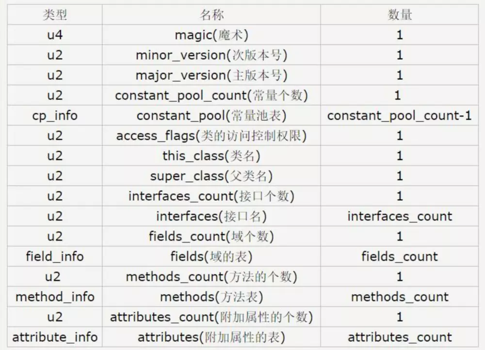
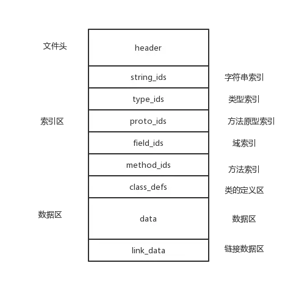
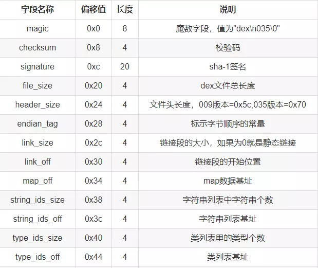
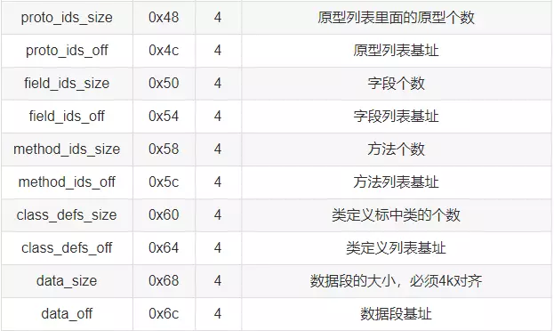

#Class文件
Class文件是Java虚拟机定义并被其所识别的文件格式，通俗地讲，每一个接口或者类对应一个Class文件。
## Class文件格式
* Class文件是一组以8位字节为基础单位的的二进制流。
* 各数据项目之间没有任何分隔符
* Class文件格式采用的结构只有两种数据结构：无符号数和表。
  * 无符号数：以u1,u2等表示1，2个字节的无符号数，无符号数可用于描述数字、索引引用、数量值、字符串值。
  * 表：以多个无符号数或者表组成，通常以_info结尾，整个Class文件就是一张表。
## Class文件的组成：

* 魔数：Class文件开始四个字节是魔数，用于验证该文件是否能被虚拟机执行
* 版本号：魔数后四个字节则是Class文件的主版本号和次版本号
* 常量池：版本号后面紧跟着的则是常量池部分。常量池不同与java中，它是由1开始计数的，常量痴表的数目是常量个数减一。第0项为保留项目，用于指示当前Class文件不需要引用任何一个常量池。常量池中主要包含两大类常量：
  * 字面量：包括文本字符串，被声明为final的常量值等。
  * 符号引用：包括类和接口的权限定名，字段的名称和描述符，方法的名称和描述符
* 访问标志：常量池部分结束后则是访问标志部分，该部分包括信息：是类还是接口，是否定义为public，是否final，是否abstract等信息。
* 访问标志之后则是类索引，父类索引，接口索引集合部分，该部分的主要信息为：该类的信息的索引，父类的信息的索引，实现接口的个数和对应接口信息的索引。（通过指向一个类型为CONSTANT_Class_info的类描述符常量，从而在对应的常量池找到相关信息）
* 字段表：接下来的部分则是用于描述类声明的变量信息，包括变量的作用域，是否为static，是否为final等信息。
* 方法表：方法表则是用于描述类中方法的信息，与字段表类似。
* 属性表：属性表在字段表和方法表中都会出现，主要用于描述某些场景特有的信息。比如方法是否抛出异常，被final声明的变量的值，内部类列表等信息。
# Dex文件
Dex是Android平台上(Dalvik虚拟机，art虚拟机)的可执行文件，每个APK压缩包中都包含一个（或者多个MultiDex）Dex文件，Dex文件中包含了app的所有源码。
## Dex文件的结构
* Dex文件是一组以8位字节为基础单位的的二进制流。
* Dex文件的各数据项目之间也没有任何分隔符
* Dex文件由文件头，索引区，数据区三个部分组成

* 其各个元素的解释如下：
  * header：dex文件头部，记录整个dex文件的相关属性
  * string_ids：字符串数据索引，记录了每个字符串在数据区的偏移量
  * type_ids：类型数据索引，记录了每个类型的字符串索引
  * proto_ids：原型数据索引，记录了方法声明的字符串，返回类型字符串，参数列表
  * field_ids：字段数据索引，记录了所属类，类型以及方法名
  * method_ids：类方法索引，记录方法所属类名，方法声明以及方法名等信息
  * class_defs：类定义数据索引，记录指定类各类信息，包括接口，超类，类数据偏移量
  * data：数据区，保存了各个类的真实数据
  * link_data：连接数据区
### header
文件头记录了dex文件的一些基本信息, 以及大致的数据分布。其各字段及解释如下：

### 索引区
索引区中索引了整个dex中的字符串、类型、方法声明、字段以及方法的信息, 其结构体的开始位置和个数均来自dex文件头中的记录
* 字符串索引区：描述dex文件中所有的字符串信息
* 类型索引区：描述dex文件中所有的类型, 如类类型、基本类型、返回值类型等
* 方法声明索引区：描述dex文件中所有的方法声明
* 字段索引区：描述dex文件中所有的字段声明, 这个结构中的数据全部都是索引值, 指明了字段所在的类、字段的类型以及字段名称
* 方法索引区：描述Dex文件中所有的方法, 指明了方法所在的类、方法的声明以及方法名字
### 数据区
索引区中的最终数据偏移以及文件头中描述的偏移都指向数据区, 还包括了即将要解析的class_def_item
* class_def_item：这个结构由dex文件头中的classDefsSize和classDefsOff所指向, 描述Dex文件中所有类定义信息, 每一个DexClassDef中包含一个DexClassData的结构(classDataOff),每一个DexClassData中包含了一个Class的数据, Class数据中包含了所有的方法, 方法中包含了该方法中的所有指令
# Class文件和Dex文件对比
* Class文件是JVM的执行文件，而Dex文件是安卓虚拟机（Dalvik，art）的执行文件
* Class文件对应Java中每一个类，而Dex文件则包含整个APK文件中的JAVA代码，故Dex文件可以大大缩小体积，减少Class文件的数据冗余，有利于在移动端中运行。（可以通过SDK中的dx命令将若干个Class文件转化为Dex文件）
