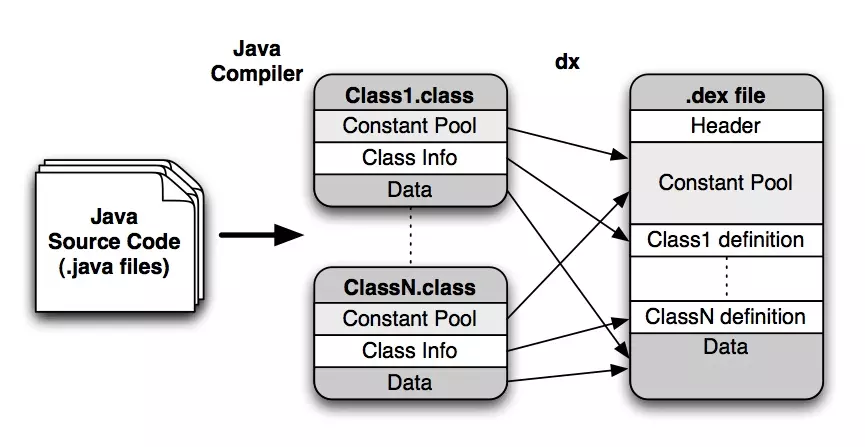

# JVM和DVM的区别
* DVM和 JVM 执行的字节码文件的区别
  JVM执行的字节码文件是.class文件，而DVM上执行的则是Dex文件。之前的文章已经详细分析了这两种文件的区别，这里放一个图加深记忆

* JVM是基于栈，而DVM是基于寄存器的
  由于CPU访问寄存器速度快于访问内存速度，所以DVM在编译的时候花费时间更少，运行更快
* DVM可以在有限的内存中同时运行多个虚拟机的实例，所以Android为每一个进程分配一个DVM虚拟机，这样可以防止虚拟机崩溃的时候所有程序都被关闭。
* Android中存在一个虚拟机进程Zygote，作为虚拟机实例的孵化器，它在系统启动的时候就会产生，它会完成虚拟机的初始化、库的加载、预制类库和初始化的操作。如果系统需要一个新的虚拟机实例，它会迅速复制自身，以最快的速度提供给系统。
# DVM和ART的区别
在Android5.0中，ART取代了Dalvik虚拟机，成为了Android下的默认执行虚拟机。
* DVM每次运行都需要通过即时编译器（JIT）去将字节码转换为机器码，导致启动程序的速度较慢，但可以获得更快的安装时间和较小的空间占用。
* ART则是在应用安装时就预编译字节码到机器语言并存储在本地，这样在运行程序时就不会每次都进行一次编译了，提高了执行效率和启动速度，但相反的也增加了占用的空间，是一种典型的空间换时间的策略。

