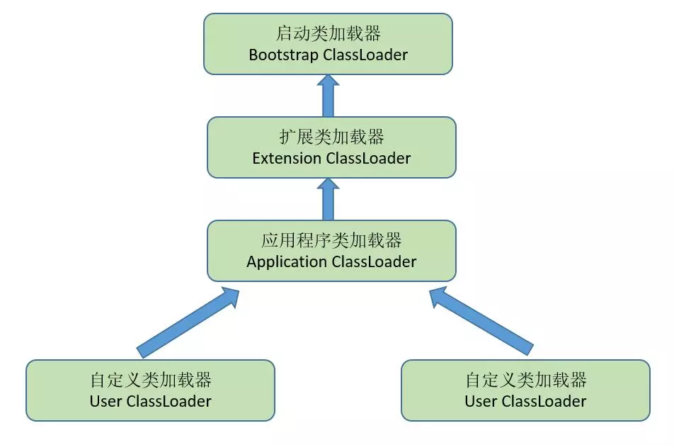

# 虚拟机类加载机制
* 类加载过程是指虚拟机将描述类的数据从Class文件中加载到内存，并对数据进行校验，转化解析和初始化，最终形成可以被虚拟机直接使用的Java类型的过程。
* 在Java中，类的加载和连接过程都是在程序运行期间完成。虽然会增加运行时的性能开销，但可以提高程序灵活性，这也是Java能够实现动态加载的原因之一。
## 类加载的过程
虚拟机类加载过程分为加载，验证，准备，解析，初始化，使用，卸载七个阶段。其中验证，准备，解析三个部分成为连接阶段。
### 加载
一般来说，在遇到了以下四种情况的时候，虚拟机会开始进行类的加载：
* 使用new关键字实例化对象，读取或者设置一个类的静态变量（被final修饰的除外，已经在编译器被加入常量池），以及调用一个类的静态方法的时候
* 对类进行反射调用的时候
* 当初始化一个类时，如果其父类没有被加载，则先对其父类进行加载
* 当虚拟机启动的时候，用户指定的（包含main方法）的类会被加载
在类的加载阶段，虚拟机会完成一下三件事情:
* 通过一个类的全限定名获取定义类的二进制字节流
* 将这个字节流所代表的静态存储结构转化为方法区的运行时数据结构
* 在Java堆中生成一个代表这个类的Class对象，作为方法区这些数据的访问入口。
### 验证
这一阶段是为了确保class文件的字节流包含的信息符合当前虚拟机的要求，并且不会危害虚拟机自身的安全。主要包括以下几个过程：
* 文件格式验证
* 元数据验证
* 字节码验证
* 符号引用验证
### 准备
准备阶段是正式为类变量分配内存并设置类变量初始值的阶段，这些内存都将在方法区中进行分配。这个阶段中进行内存分配的变量只有被static修饰的变量，并将其设置为默认值，而真正的赋值则在初始化阶段。另外，被final static字段修饰的常量在编译器就已经被赋值。
### 解析
解析阶段主要是虚拟机将常量池内的符号引用替换为直接引用的过程。
### 初始化
初始化阶段是执行类构造器<cinit>()方法的过程。
<cinit>()与类的构造方法不同，<cinit>()方法是由编译器自动收集类中的所有类变量的赋值动作和静态语句块中的语句合并而成的。编译器收集的顺序是按语句在源文件中出现的顺序决定的，静态语句块中只能访问定义在它之前的静态变量，定义在它之后的静态变量，只可以赋值，不可以访问。
虚拟机会保证子类的<cinit>()方法执行之前，其父类的<cinit>()方法一定被执行（父类先与子类完成加载过程）
# Java中的ClassLoader
类加载阶段中，实现“通过一个类的全限定名获取定义类的二进制字节流”的动作被放在了虚拟机外部去实现，以便应用程序决定如何去加载所需要的类，实现这个动作的代码模块被称为“类加载器”
从Java虚拟机的角度上讲，只存在两种不同的类加载器：
  * Bootstrap ClassLoader：使用C++实现，是虚拟机的一部分。它主要负责加载存放在%JAVAHOME%/lib目录中的，或者被-Xbootclasspath指定的类库到虚拟机内存中，Bootstrap ClassLoader无法被java程序直接引用。
  * 继承自java.lang.ClassLoader的类加载器：
    * Extension ClassLoader：主要负责加载%JAVAHOME%/lib/ext目录中的，或者被java.ext.dirs系统变量指定路径的所有类。
    * Application ClassLoader：也被称为系统类加载器（因为其实getSystemClassLoader的返回对象），主要负责加载用户类路径（ClassPath）下的类库
## 类的双亲委派模型
这些类加载器之间的关系如下：



双亲委派模型中，除了顶层的BootstrapClassLoader，其他类加载器都要求有自己的父类加载器，这里的类加载器一般以组合的方式实现。
* 双亲委派模型的工作过程是：当一个类加载器收到一个类加载请求的时候，他首先不会自己加载这个类，而是将这个请求委派给父类加载器去完成，只有当父类加载器无法完成这个加载请求时，子加载器才会尝试自己去加载。
* 双亲委派模型的作用：
  * 使得java类随着它的类加载器一起具备了一种带有优先级的层次关系
  * 保证Java环境的稳定性
  * 避免重复加载，如果已经加载过一次Class，就不需要再次加载，而是先从缓存中直接读取。 
# Android中的ClassLoader
* 由于Android虚拟机的执行文件是Dex文件，而不是JVM中的Class文件，所以Java中的类加载器是无法加载Dex文件的，因此，Android中存在另外一套ClassLoader。
## Android的ClassLoader类型
Android中的ClassLoader根据用途可分为一下几种：
* BootClassLoader：主要用于加载系统的类，包括java和android系统的类库，和JVM中不同，BootClassLoader是ClassLoader内部类，是由Java实现的，它也是所有系统ClassLoader的父ClassLoader
* PathClassLoader：用于加载Android系统类和开发编写应用的类，只能加载已经安装应用的 dex 或 apk 文件，也是getSystemClassLoader的返回对象
* DexClassLoader：可以用于加载任意路径的zip,jar或者apk文件，也是进行安卓动态加载的基础
### Android中ClassLoader的继承关系


### ClassLoader的执行过程
* 从上面的ClasLoader结构图可以看到，ClassLoader的主要逻辑主要集中在ClassLoader和BaseDexClassLoder这两个类中。
#### ClasLoader
* ClasLoader是所有ClassLoader的父类，它定义了加载Class的一般行为。
* 与Java中不同，Android中加载类的过程主要是由loadClass方法实现，而在Java中则是findClass方法。
```
protected Class<?> loadClass(String className, boolean resolve) throws ClassNotFoundException {
    Class<?> clazz = findLoadedClass(className);
    if (clazz == null) {
        ClassNotFoundException suppressed = null;
        try {
            clazz = parent.loadClass(className, false);
        } catch (ClassNotFoundException e) {
            suppressed = e;
        }
        if (clazz == null) {
            try {
                clazz = findClass(className);
            } catch (ClassNotFoundException e) {
                e.addSuppressed(suppressed);
                throw e;
            }
        }
    }
    return clazz;
}
```
* 可以看到，当收到一个加载类请求的时候，ClassLoader会先调用findLoadedClass查询是否本类是否被本加载器加载过（调用JNI方法），如果没有被加载则把请求委托给父加载器，当父加载器无法完成加载行为的时候，才会调用findClass方法尝试自己加载，而ClassLoader中的findClass方法并没有实现，而是交给子类去是实现。


#### BaseDexClassLoader
* 作为ClassLoader的直接子类，BaseDexClassLoader实现加载findClass方法的主要逻辑，而其子类DexClassLoader和PathClassLoader都只是加载路径以及某些行为不同而已


* 可以看到findClass方法是又是调用了pathList的findClass方法去加载类，而pathList则是一个DexPathList对象，它的findClass对象是这样实现的：


* 其中DexFile是Dex文件在Java中的表现形式，而它的loadClassBinaryName方法则是最后调用了JNI方法去完成在dex文件在加载Class对象。


#### DexClassLoader和PathClassLoader
* DexClassLoader和PathClassLoader都是BaseDexClassLoader的子类，他们的实现也很简单，只是构造方法传入了不同的参数而已：
  * DexClassLoader ：


  * PathClassLoader：


* 可以看到，DexClassLoader和PathClassLoader的区别就是，PathClassLoader的第二个参数传为NULL，回到BaseDexClassLoader中可以看到：


* 根据注释可以看到optimizedDirectory参数是用来放置DexFile的，那么具体是怎么回事呢，再进入DexPathList


* optimizedDirectory被传进了makeDexElements方法


* 又被传进了loadDexFile


* 可以看到，如果optimizedDirectory为NULL，则会以原来的路径创建DexFile，否则会以optimizedDirectory为路径创建DexFile

* 其实optimizedDirectory是要求一个内部路径的，因为动态加载去加载的可执行文件一定要存放在内部存储。而DexClassLoader可以指定optimizedDirectory，所以它可以加载外部的dex，并且这个dex会被复制到内部路径的optimizedDirectory；而PathClassLoader没有optimizedDirectory，所以它只能加载内部路径的dex，也就是存在于已经安装过的apk里面的。