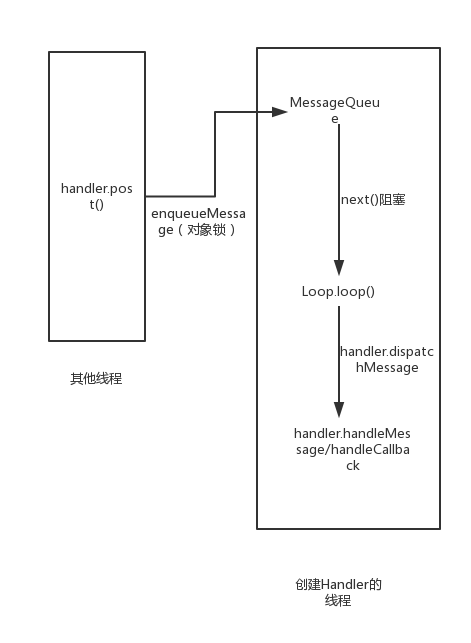

# 具体流程
* 一般来说，我们使用Handler机制来进行跨线程更新UI的操作，如下图。


* 首先通过在子线程中调用定义在UI线程的handler.post()或者handler.sendMessage()方法发送消息（post()方法其实也是包装成了一个带Runnable的Message）到MessageQueue，也就是调用了MessageQueue.enqueueMessage()方法。
* 然后线程中的Looper通过loop()方法不断从MessageQueue中取出消息，并调用消息中携带的handler实例的dispatchMessage()方法，将消息发送到handler中的handleMessage()执行，从而完成跨线程的操作。
* 而为什么要有这样一个机制来进行跨线程的信息传递呢，我们可以设想一下，如果没有这样一个机制，直接从子线程中调用handler.handleMessage()进行操作，那么每次每个线程访问handler都必须先对其加一个互斥锁，保证它的线程安全性，加锁放锁的操作使handler的处理效率大大折扣，并且如果有一些操作比较长的话，其他线程就会被白白阻塞过长的时间，所以handler机制将这个线程间的消息传递必须的加锁放锁消耗放在了MessageQueue.enqueueMessage()，由于enqueueMessage()只是简单的把放进来的消息按照它的发送时间插入链表中，所以使得子线程的插入可以很快完成，减少它的阻塞时间。
#分步解析
##Handler发送消息
* 通常我们会调用handler.post()或者handler.sendMessage()方法将我们需要做的事情发送出去，其实他们里头都是调用了sendMessageAtTime这个方法，区别是post()方法我们传入的是一个runnable参数，而sendMessage()方法我们传入的是一个message实例，如果我们没有设置message的runnable变量的话，最终就会用handler的handleMessage()方法里进行操作。

```
    public boolean sendMessageAtTime(Message msg, long uptimeMillis) {
        MessageQueue queue = mQueue;
        if (queue == null) {
            RuntimeException e = new RuntimeException(
                    this + " sendMessageAtTime() called with no mQueue");
            Log.w("Looper", e.getMessage(), e);
            return false;
        }
        return enqueueMessage(queue, msg, uptimeMillis);
    }
```
* 再来看到enqueueMessage方法
```
    private boolean enqueueMessage(MessageQueue queue, Message msg, long uptimeMillis) {
        msg.target = this;
        if (mAsynchronous) {
            msg.setAsynchronous(true);
        }
        return queue.enqueueMessage(msg, uptimeMillis);
    }
```
* 当然这个是handler的enqueueMessage方法，它就是把msg的target设置为本身，所以最后处理message的操作才会在对应的handler中完成，并且通过setAsynchronous设置异步消息，至于什么是异步消息呢，后面会讲到其实messageQueue中有一个postSyncBarrier的方法，可以设置一个Barrier来阻塞同步的消息，而异步的消息则不受这个Barrier的影响，而通过removeSyncBarrier方法可以移除这个Barrier，当然这里我们的消息默认是同步的，你可以自己在message中设置为异步消息，也可以通过构造Handler的时候传入参数来设置默认为异步消息。
* 还有一点需要注意的是为什么要通过msg.target = this来设置handler呢，是因为一个线程中是可以有多个handler的，但是只能有一个Looper和一个MessageQueue，因为Looper是存放在Thread的ThreadLocal中的，而MessageQueue是在Looper被创建的时候创建的。
##MessageQueue插入消息
* MessageQueue通过enqueueMessage方法插入消息，方法并不难，首先是检查msg的一些参数是否正确，然后去竞争一个对象锁。这里有一个synchronized使用的小技巧就是，在方法体内才去获得这个锁，这样的话，就不用在synchronized内部再去做进入方法的一些操作，提高了synchronized代码块的吞吐量。
```
boolean enqueueMessage(Message msg, long when) {
        if (msg.target == null) {
            throw new IllegalArgumentException("Message must have a target.");
        }
        if (msg.isInUse()) {
            throw new IllegalStateException(msg + " This message is already in use.");
        }

        synchronized (this) {
            if (mQuitting) {
                IllegalStateException e = new IllegalStateException(
                        msg.target + " sending message to a Handler on a dead thread");
                Log.w(TAG, e.getMessage(), e);
                msg.recycle();
                return false;
            }

            msg.markInUse();
            msg.when = when;
            Message p = mMessages;
            boolean needWake;
            if (p == null || when == 0 || when < p.when) {
                // New head, wake up the event queue if blocked.
                msg.next = p;
                mMessages = msg;
                needWake = mBlocked;
            } else {
                // Inserted within the middle of the queue.  Usually we don't have to wake
                // up the event queue unless there is a barrier at the head of the queue
                // and the message is the earliest asynchronous message in the queue.
                needWake = mBlocked && p.target == null && msg.isAsynchronous();
                Message prev;
                for (;;) {
                    prev = p;
                    p = p.next;
                    if (p == null || when < p.when) {
                        break;
                    }
                    if (needWake && p.isAsynchronous()) {
                        needWake = false;
                    }
                }
                msg.next = p; // invariant: p == prev.next
                prev.next = msg;
            }

            // We can assume mPtr != 0 because mQuitting is false.
            if (needWake) {
                nativeWake(mPtr);
            }
        }
        return true;
    }
```
* 可以看到，enqueueMessage方法主要是通过该message的发送时间来选择将其插入链表中的位置，即时间小(when)的插在链表前面，这样looper通过next()方法拿的时候，一定是拿到当前需要被处理的message。
* 其中可以看到有关needWake条件的判断：
    1> 如果当前是唯一的一个消息并且队列处于阻塞状态，需要wake
    2> 如果当前当前消息的处理时间为现在或者为队列中最早的消息并且队列处于阻塞状态，需要wake
    3> 如果当前队列中处于上游的message都不是异步消息，而本身是异步消息，需要wake
* 那么为什么需要唤醒CPU呢？又或者说线程什么时候被阻塞了呢？我们知道，活线程一般来说有三种状态，runnable，running,  blocked，其中会消耗CPU资源的自然是running状态。我们又知道，Looper.loop()方法是一个死循环，如果不把它阻塞了，它就会一直占用CPU资源（在自己的时间片内）而不做任何事情，这当然是很浪费的，所以我们肯定需要将它放在一个阻塞队列中，需要它执行的时候再唤醒它。一般来说，在Handler机制中需要判断是否唤醒Handler所在线程的时机有message入队的时候，即我们上面分析的三种情况，还有一个地方是接下来要讨论的next()方法中，并其也是在next()方法中被阻塞的。
##MessageQueue提供消息
* MessageQueue通过next()方法，向Looper提供消息。
```
 Message next() {
        // Return here if the message loop has already quit and been disposed.
        // This can happen if the application tries to restart a looper after quit
        // which is not supported.
        final long ptr = mPtr;
        if (ptr == 0) {
            return null;
        }

        int pendingIdleHandlerCount = -1; // -1 only during first iteration
        int nextPollTimeoutMillis = 0;
        for (;;) {
            if (nextPollTimeoutMillis != 0) {
                Binder.flushPendingCommands();
            }

            nativePollOnce(ptr, nextPollTimeoutMillis);

            synchronized (this) {
                // Try to retrieve the next message.  Return if found.
                final long now = SystemClock.uptimeMillis();
                Message prevMsg = null;
                Message msg = mMessages;
                if (msg != null && msg.target == null) {
                    // Stalled by a barrier.  Find the next asynchronous message in the queue.
                    do {
                        prevMsg = msg;
                        msg = msg.next;
                    } while (msg != null && !msg.isAsynchronous());
                }
                if (msg != null) {
                    if (now < msg.when) {
                        // Next message is not ready.  Set a timeout to wake up when it is ready.
                        nextPollTimeoutMillis = (int) Math.min(msg.when - now, Integer.MAX_VALUE);
                    } else {
                        // Got a message.
                        mBlocked = false;
                        if (prevMsg != null) {
                            prevMsg.next = msg.next;
                        } else {
                            mMessages = msg.next;
                        }
                        msg.next = null;
                        if (DEBUG) Log.v(TAG, "Returning message: " + msg);
                        msg.markInUse();
                        return msg;
                    }
                } else {
                    // No more messages.
                    nextPollTimeoutMillis = -1;
                }

                // Process the quit message now that all pending messages have been handled.
                if (mQuitting) {
                    dispose();
                    return null;
                }

                // If first time idle, then get the number of idlers to run.
                // Idle handles only run if the queue is empty or if the first message
                // in the queue (possibly a barrier) is due to be handled in the future.
                if (pendingIdleHandlerCount < 0
                        && (mMessages == null || now < mMessages.when)) {
                    pendingIdleHandlerCount = mIdleHandlers.size();
                }
                if (pendingIdleHandlerCount <= 0) {
                    // No idle handlers to run.  Loop and wait some more.
                    mBlocked = true;
                    continue;
                }

                if (mPendingIdleHandlers == null) {
                    mPendingIdleHandlers = new IdleHandler[Math.max(pendingIdleHandlerCount, 4)];
                }
                mPendingIdleHandlers = mIdleHandlers.toArray(mPendingIdleHandlers);
            }

            // Run the idle handlers.
            // We only ever reach this code block during the first iteration.
            for (int i = 0; i < pendingIdleHandlerCount; i++) {
                final IdleHandler idler = mPendingIdleHandlers[i];
                mPendingIdleHandlers[i] = null; // release the reference to the handler

                boolean keep = false;
                try {
                    keep = idler.queueIdle();
                } catch (Throwable t) {
                    Log.wtf(TAG, "IdleHandler threw exception", t);
                }

                if (!keep) {
                    synchronized (this) {
                        mIdleHandlers.remove(idler);
                    }
                }
            }

            // Reset the idle handler count to 0 so we do not run them again.
            pendingIdleHandlerCount = 0;

            // While calling an idle handler, a new message could have been delivered
            // so go back and look again for a pending message without waiting.
            nextPollTimeoutMillis = 0;
        }
    }

```
* 继续回到我们之前的问题，Handler线程是在next()方法被阻塞的，具体阻塞的方法就是nativePollOnce(ptr, nextPollTimeoutMillis)这个方法，它通过计算得到的nextPollTimeoutMillis也就是消息队列第一个消息需要被执行的时间来决定自己要被阻塞的时长，其中-1代表一直被阻塞，直至在有message入队列的时候根据情况被唤醒。
* 然后就是判断是否有barrier，判断的条件就是当前的第一个消息的target是否为空，也就是说设置barrier的实质就是插入一条targer为null的消息。如果有barrier，则找最前面的一条异步消息，找不到则进入时长为-1的阻塞。
* 而没有barrier的情况，则是通过第一个message的执行时间与当前时间对比，小于则计算下次需要阻塞的时间，否则就将第一条消息返回，并且将mBlocked标识置为false;
* 而如果没有找到当前需要发送的message的话，也就是说，此时的消息队列是空闲的，就会去查看当前队列是否存在空闲的idelHandler需要被执行，如果有的话只取前四个进行执行，这里也是考虑到执行操作的消耗时间太长会影响后面消息的发送，增加造成AND的可能（如果是主线程中的话），所以如果是主线程中的MessageQueue也不要在idelHandler进行耗时的操作。执行完idelHandler后，就会将pendingIdleHandlerCount置0，所以在下次next()被调用前，它不是不会再被执行的，并且如果这次循环执行过idelHandler，也会设置nextPollTimeoutMillis=0，不让线程被阻塞，所以可以继续判断有无需要被发送的消息。
##Looper传递消息
* 每个线程中的Looper，如果调用了loop()方法后，都会进入一个死循环，不断从MessageQueue中取出消息并分发到Handler中处理。比如说android主线程中的Looper.loop()就是在ActivitryThread的main()方法中被调用的，并且整个android中的操作，比如activity的生命周期回调等，都是通过发送Message最后通过ActivitryThread.H进行处理的。
* 回到loop()方法，这个方法比较简单，就是通过queue.next()方法取得message实例（有可能被阻塞，阻塞和唤醒的机制也在上面MessageQueue中分析过啦），然后通过调用msg.target.dispatchMessage(msg)将message实例发送到对应的Handler中处理，这里也是为什么同线程中多个Handler能独立处理各种的消息的原因。
* 最后就是将handler处理过message对象重新放回msg的缓冲池（一个单链表）中，所以我们使用消息的时候也可以通过Message.obtain方法进行复用消息。可想而知，Message.obtain方法肯定是需要加互斥锁的，并且肯定会出现多个线程请求message的情况。
```
public static void loop() {
        final Looper me = myLooper();
        if (me == null) {
            throw new RuntimeException("No Looper; Looper.prepare() wasn't called on this thread.");
        }
        final MessageQueue queue = me.mQueue;

        // Make sure the identity of this thread is that of the local process,
        // and keep track of what that identity token actually is.
        Binder.clearCallingIdentity();
        final long ident = Binder.clearCallingIdentity();

        for (;;) {
            Message msg = queue.next(); // might block
            if (msg == null) {
                // No message indicates that the message queue is quitting.
                return;
            }

            // This must be in a local variable, in case a UI event sets the logger
            final Printer logging = me.mLogging;
            if (logging != null) {
                logging.println(">>>>> Dispatching to " + msg.target + " " +
                        msg.callback + ": " + msg.what);
            }

            final long slowDispatchThresholdMs = me.mSlowDispatchThresholdMs;

            final long traceTag = me.mTraceTag;
            if (traceTag != 0 && Trace.isTagEnabled(traceTag)) {
                Trace.traceBegin(traceTag, msg.target.getTraceName(msg));
            }
            final long start = (slowDispatchThresholdMs == 0) ? 0 : SystemClock.uptimeMillis();
            final long end;
            try {
                msg.target.dispatchMessage(msg);
                end = (slowDispatchThresholdMs == 0) ? 0 : SystemClock.uptimeMillis();
            } finally {
                if (traceTag != 0) {
                    Trace.traceEnd(traceTag);
                }
            }
            if (slowDispatchThresholdMs > 0) {
                final long time = end - start;
                if (time > slowDispatchThresholdMs) {
                    Slog.w(TAG, "Dispatch took " + time + "ms on "
                            + Thread.currentThread().getName() + ", h=" +
                            msg.target + " cb=" + msg.callback + " msg=" + msg.what);
                }
            }

            if (logging != null) {
                logging.println("<<<<< Finished to " + msg.target + " " + msg.callback);
            }

            // Make sure that during the course of dispatching the
            // identity of the thread wasn't corrupted.
            final long newIdent = Binder.clearCallingIdentity();
            if (ident != newIdent) {
                Log.wtf(TAG, "Thread identity changed from 0x"
                        + Long.toHexString(ident) + " to 0x"
                        + Long.toHexString(newIdent) + " while dispatching to "
                        + msg.target.getClass().getName() + " "
                        + msg.callback + " what=" + msg.what);
            }

            msg.recycleUnchecked();
        }
    }
```
##Handler处理Message
* 在Looper.loop()方法中调用了Handler的dispatchMessage来处理消息，那么具体dispatchMessage做了什么呢。
```
    public void dispatchMessage(Message msg) {
        if (msg.callback != null) {
            handleCallback(msg);
        } else {
            if (mCallback != null) {
                if (mCallback.handleMessage(msg)) {
                    return;
                }
            }
            handleMessage(msg);
        }
    }
```
* 可以看到dispatchMessage方法主要是通过msg以及Handler的设置来决定回调的方法的：
  1> 如果msg设置了callback，执行callback并返回。
  2> 否则，查看handler是否有设置mCallback，如果有，调用mCallback.handleMessage。如果mCallback.handleMessage返回true，返回方法。否则继续执行Handler的handleMessage方法。
  3> 否则，执行Handler的handleMessage方法。
* 从上面的回调过程中可以发现，如果是采用Handler.post方法提交的消息，则不用管handleMessage的问题，如果我们是采用Handler.sendMessage方法提交的消息的话，如果messgae没有设置callback，则记得重写handleMessage方法或者给Handler设置一个callback。
#总结
* Handler机制到这里就差不多分析完了，其实还有一些附加的小问题，比如loop方法怎么样退出呀，怎样设置MessageQueue的屏障呀，还是挺多地方可以再去深挖的。