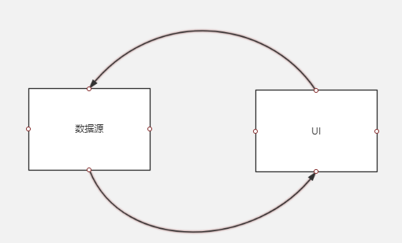

# DataBinding学习笔记

DataBinding 是 google 推出的 MVVM 架构组件，可以实现 UI 和数据的双绑定。DataBinding 是一个 support 库，所以低版本的 Android 项目可以通过导入依赖的方式进行兼容使用，最低可以兼容到 Android 2.1。
<a name="nrdsxk"></a>
# 基本用法
<a name="ovmekp"></a>
## 配置 gradle
由于 DataBinding 的实现需要 gradle 在编译期做一些处理（动态生成 Binding 类，修改 xml 文件等），所以需要在 gradle 中增加：
```java
dataBinding {
    enabled = true
}
```


<a name="1eh6ue"></a>
## 编写布局文件
DataBinding 的绑定是直接在 xml 层进行绑定的，所以在编写 xml 文件的时候需要把用到的数据 Bean 类传进去，并且外层需要用标记。而传入 Bean 类有两种形式，一种是直接传入包名，一种是通过 import 的形式导入。
```xml
<?xml version="1.0" encoding="utf-8"?>
<layout xmlns:android="http://schemas.android.com/apk/res/android">

    <data>

        <variable
            name="product"
            type="com.james.bindingdemo.Product"/>

        <!--import 的形式导入-->
        <!--
            <import type="com.james.bindingdemo.Product"/>
            <variable
                name="product"
                type="Product"/>
        -->

    </data>

    <LinearLayout
        android:orientation="vertical"
        android:layout_width="match_parent"
        android:layout_height="match_parent">

        <TextView
            android:text="@{product.name}"
            android:layout_width="wrap_content"
            android:layout_height="wrap_content" />

    </LinearLayout>

</layout>
```
<a name="l2gmrk"></a>
## 数据源与 UI 绑定
* 首先将布局文件通过 DataBindingUtil 与 Activity 进行绑定，其返回的 ActivityTestBinding 是在编译器自动生成的类，是数据源和 UI 桥梁。

```java
public class TestActivity extends AppCompatActivity {

    @Override
    protected void onCreate(@Nullable Bundle savedInstanceState) {
        super.onCreate(savedInstanceState);
        ActivityTestBinding binding = DataBindingUtil.setContentView(this, R.layout.activity_test);
    }
}
```


* 当数据源发生变化的时候通过 ActivityTestBinding 类的 setProduct 可以更新 UI，其中 setProduct 是根据前面 xml 中的 name 属性动态生成的。

```java
Product product = new Product("product");
binding.setProduct(product);
```


* 上面的 Product 类如果只是简单的 Java Bean 是无法做到数据更新后驱动 UI 进行更新的。要做到双向绑定有两种方式：继承 BaseObservable 和使用 ObservableField。

  * 继承BaseObservable。继承 BaseObservable 后，如果要绑定的变量是 private 的，需要在它对应的 get 方法中加上@Bindable。如果变量是 public 的，则要在变量上面加@Bindable。其中 notifyPropertyChanged 方法是指只更新单个变量，而 notifyChange 则是更新类中所有的变量

```java
public class Product extends BaseObservable{

    /*
     * 如果成员变量是 public 则要在成员变量上面加@Bindable 注解
     */

    private String name;

    public Product(String name) {
        this.name = name;
    }
    @Bindable
    public String getName() {
        return name;
    }

    public void setName(String name) {
        this.name = name;
        notifyPropertyChanged(BR.name);
      //notifyChange();
    }
}
```

  * 使用 ObservableField。ObservableField 支持使用泛型对数据进行包装，同时对基础数据类型提供了 ObservableInt、ObservableBoolean 等实现类。

```java
public class Product {

    private ObservableField<String> name = new ObservableField<>();

    public Product(String name) {
        this.name.set(name);
    }

    public ObservableField<String> getName() {
        return name;
    }

    public void setName(ObservableField<String> name) {
        this.name = name;
    }

}
```
* 添加对数据的监听。当数据源发生了变更，可以添加相应的回调动作。

  * 首先需要将修改 XML：将原来的“@{}”改成@={}

```xml
<TextView
    android:text="@={product.name}"
    android:layout_width="wrap_content"
    android:layout_height="wrap_content" />
```
  * 添加回调

```java
product.getName().addOnPropertyChangedCallback(new Observable.OnPropertyChangedCallback() {
    @Override
    public void onPropertyChanged(Observable sender, int propertyId) {
        //callback
    }
});
```


<a name="7gu7hm"></a>
## 事件处理
DataBinding 中的事件处理也是通过在 XML 中传入对应的 CallBack 来进行调用的。在导入相应的 CallBack 类后，在各个控件的点击事件中可以调用相应的回调方法。
```xml
<?xml version="1.0" encoding="utf-8"?>
<layout xmlns:android="http://schemas.android.com/apk/res/android">

    <data>

        <variable
            name="product"
            type="com.james.bindingdemo.Product"/>

        <variable
            name="handler"
            type="com.james.bindingdemo.EventHandler"/>
    </data>

    <LinearLayout
        android:orientation="vertical"
        android:layout_width="match_parent"
        android:layout_height="match_parent">

        <TextView
            android:text="@{product.name}"
            android:layout_width="wrap_content"
            android:layout_height="wrap_content" />

        <Button
            android:onClick="@{handler.onClick}"
            android:text="button"
            android:layout_width="match_parent"
            android:layout_height="wrap_content" />

        <EditText
            android:onTextChanged="@{handler.onTextChanged}"
            android:layout_width="match_parent"
            android:layout_height="wrap_content" />

    </LinearLayout>

</layout>
```

<br />CallBack 类中的方法参数必须严格和系统 API 中的参数一致：
```java
public class EventHandler {

    public void onClick(View view) {

    }

    public void onTextChanged(CharSequence s, int start, int before, int count) {

    }

}
```


<a name="4g1ezp"></a>
# 使用 BindingAdapter
BindingAdapter 是 DataBinding 提供的一个在 XML 与实际控件之间的 AOP 口子。比如，在 XML 中已经声明了“android:text="12345"”，而通过 BindingAdapter 可以在 TextView.setText()发生之前调用 BindingAdapter 注解的方法，从而向用户提供切口。
* 比如，使用 BindingAdapter 为所有的 TextView 的 text 增加统一的后缀

```java
@BindingAdapter("android:text")
public static void setText(TextView view, String text) {
    view.setText(text + "后缀");
}
```


* 为自定义的命名空间属性提供回调的接口。比如下面的代码可以在 Product 的 imgUrl 属性发生了改变之后自动对 ImageView 的图片进行更新加载。（前提是 Product 与 XML 进行双向绑定）

```xml
<ImageView
    android:layout_width="160dp"
    android:layout_height="160dp"
    bind:url="@{product.imgUrl}"/>
```
```java
@BindingAdapter({"url", "name"})
public static void loadImageView(ImageView view, String url) {
    Glide.with(view.getContext())
            .load(url)
            .into(view);
}
```


* 在 DataBinding 的源码中则是通过这个注解来实现双向绑定的死循环问题。
（即数据源更新驱动 UI 刷新，UI 更新又驱动数据源更新）


<br />

* 系统的 TextViewBindingAdapter 类中，通过 BindingAdapter 注解侵入 setText 的过程，比较新旧 text 是否相同，相同则直接返回

```java
@BindingAdapter("android:text")
public static void setText(TextView view, CharSequence text) {
    final CharSequence oldText = view.getText();
    if (text == oldText || (text == null && oldText.length() == 0)) {
        return;
    }
    if (text instanceof Spanned) {
        if (text.equals(oldText)) {
            return; // No change in the spans, so don't set anything.
        }
    } else if (!haveContentsChanged(text, oldText)) {
        return; // No content changes, so don't set anything.
    }
    view.setText(text);
}
```


<a name="xfv0sn"></a>
# 使用 BindingConversion
BindingConversion 可以对数据进行类型转换，比如系统使用 BindingConversion 来将 Int 值的 color 转换为 ColorDrawable 对象。
```java
@BindingConversion
public static ColorDrawable convertColorToDrawable(int color) {
    return new ColorDrawable(color);
}
```

<br />在 xml 中，以@color 引用的 int 值都会被转换为 ColorDrawable 对象
```xml
<View
    android:background="@{@color/white}"
    android:layout_width="wrap_content"
    android:layout_height="wrap_content"/>
```


<a name="w7anic"></a>
# 使用 DataBindingComponent
BindingAdapter 注解虽然可以对 xml 的属性进行拦截，但是它的作用范围都是全局，而使用 DataBindingComponent 可以避免这个情况。
* 首先创建一个 AbstractAdapter 类，以及它的实现类

```java
public abstract class AbstractAdapter {

    @BindingAdapter("text")
    public abstract void setText(TextView textView, String text);

}
```
```java
public class ProductAdapter extends AbstractAdapter {
    @Override
    public void setText(TextView textView, String text) {
        textView.setText(text + "后缀");
    }
}
```


* 这时候创建一个 ProductComponent 类去实现 DataBindingComponent，它会提示必须实现 getAbstractAdapter 方法（需要先创建 AbstractAdapter，编译之后再实现 DataBindingComponent，否则会找不到相关方法）

```java
public class ProductComponent implements DataBindingComponent{

    @Override
    public AbstractAdapter getAbstractAdapter() {
        return new ProductAdapter();
    }

}
```


* 最后，在 setContentView 的时候将 ProductComponent 的实例传入

```java
protected void onCreate(@Nullable Bundle savedInstanceState) {
    super.onCreate(savedInstanceState);
    ActivityTestBinding binding = DataBindingUtil.setContentView(this, R.layout.activity_test, new ProductComponent());
}
```


* 或者通过 DataBindingUtil 进行全局设置

```java
DataBindingUtil.setDefaultComponent(new ProductComponent());
```


<a name="is2xye"></a>
# 总结
* DataBinding 作为谷歌官方 MVVM 组件提供了大量实用强大的 API，并且他是通过 support 扩展库的形式给出的，所以具有很好的向下兼容性，低版本的 android 系统也可以使用。

* 由于 Android Studio 对 DataBinding 的支持并不完善，在布局 XML 里无法直接点击类名跳转到对应的类，以及报错信息不够完善等，降低了开发效率，提高了开发的难度。

* 和之前 Android Architecture Components 的几个组件一样，DataBinding 也是蕴含了大量 AOP 思想，以最低的侵入读对系统源码进行改造，非常值得学习这种编程思想。


