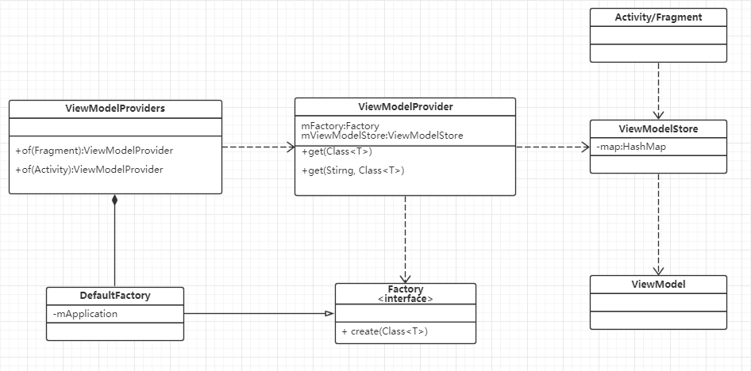
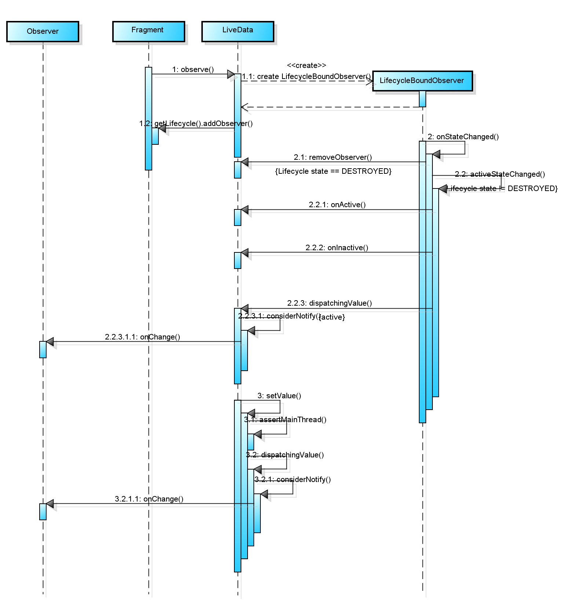
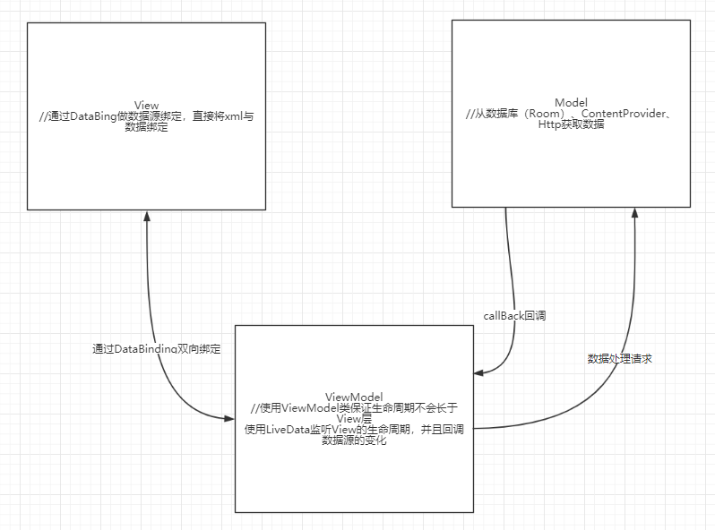

# VIewModel和LiveData学习笔记

<a name="w6f0pb"></a>
# ViewModel
<a name="ooh1un"></a>
## ViewModel 的创建和存储
ViewModel 是在 ViewModelProvider 中创建的，而 ViewModelProvider 的创建需要传入一个 Fragment 或者 Activity 作为 ViewModel 的生命周期附着上下文，最后由一个工厂类通过反射去创建对应的 ViewModel 对象。
```java
ViewModelProvider provider = ViewModelProviders.of(this);
TestViewModel model = provider.get(TestViewModel.class);
```

创建 ViewModelProvider 取到 Activity 的 ViewModelStore 对象，并且生成一个默认的工厂，用于创建 ViewModel 的实例。
```java
public static ViewModelProvider of(@NonNull FragmentActivity activity,
        @Nullable Factory factory) {
    Application application = checkApplication(activity);
    if (factory == null) {
        factory = ViewModelProvider.AndroidViewModelFactory.getInstance(application);
    }
    return new ViewModelProvider(activity.getViewModelStore(), factory);
}
```

AndroidViewModelFactory 通过反射创建 ViewModel 实例：
```java
public <T extends ViewModel> T create(@NonNull Class<T> modelClass) {
    if (AndroidViewModel.class.isAssignableFrom(modelClass)) {
        //noinspection TryWithIdenticalCatches
        try {
            return modelClass.getConstructor(Application.class).newInstance(mApplication);
        } catch (NoSuchMethodException e) {
            throw new RuntimeException("Cannot create an instance of " + modelClass, e);
        } catch (IllegalAccessException e) {
            throw new RuntimeException("Cannot create an instance of " + modelClass, e);
        } catch (InstantiationException e) {
            throw new RuntimeException("Cannot create an instance of " + modelClass, e);
        } catch (InvocationTargetException e) {
            throw new RuntimeException("Cannot create an instance of " + modelClass, e);
        }
    }
    return super.create(modelClass);
}
```

ViewModelProvider 创建 ViewModel 的时候会将 ViewModel 对象放入 ViewModelStore 中，而 ViewModelStore 实际上就是一个 HashMap，只不过在 ViewModel 被销毁的时候会调用 ViewModel.onCleared 方法，所以可以在这个方法中做一些资源回收的动作。
```java
public <T extends ViewModel> T get(@NonNull String key, @NonNull Class<T> modelClass) {
    ViewModel viewModel = mViewModelStore.get(key);

    if (modelClass.isInstance(viewModel)) {
        //noinspection unchecked
        return (T) viewModel;
    } else {
        //noinspection StatementWithEmptyBody
        if (viewModel != null) {
            // TODO: log a warning.
        }
    }

    viewModel = mFactory.create(modelClass);
    mViewModelStore.put(key, viewModel);
    //noinspection unchecked
    return (T) viewModel;
}
```

ViewModelStore：
```java
public class ViewModelStore {

    private final HashMap<String, ViewModel> mMap = new HashMap<>();

    final void put(String key, ViewModel viewModel) {
        ViewModel oldViewModel = mMap.put(key, viewModel);
        if (oldViewModel != null) {
            oldViewModel.onCleared();
        }
    }

    final ViewModel get(String key) {
        return mMap.get(key);
    }

    /**
     *  Clears internal storage and notifies ViewModels that they are no longer used.
     */
    public final void clear() {
        for (ViewModel vm : mMap.values()) {
            vm.onCleared();
        }
        mMap.clear();
    }
}
```

ViewModel 的总体结构图如下：



<a name="hgcyqa"></a>
## ViewModel 的生命周期
ViewModel 存储在 ViewModelStore 中，而 ViewModelStore 又是 Activity 的一个成员变量，所以当 Activity 因配置变更而引起重新创建的时候，ViewModelStore 按理说也会因为 Activity 的重建而被重新初始化，除非显式地在 Activity 被摧毁的时候通过 onSaveInstanceState 方法保存并在 onRestoreInstanceState 方法中恢复。而系统内部也是通过类似的手段去保证 ViewModelStore 的生命周期持续到 Activity 真正被摧毁的。
    ViewModelStore 的存储是通过 onRetainNonConfigurationInstance 和 getLastNonConfigurationInstance 这两个方法实现的，这两个方法的作用和 onSaveInstanceState 以及 onRestoreInstanceState 类似，也是在销毁的时候保存状态而重建的时候恢复状态，但是这两个方法主要是用于系统保存 Fragment 的状态。
Activity 销毁时，ViewModelStore 被存储在 NonConfigurationInstances 中：
```java
public final Object onRetainNonConfigurationInstance() {
    Object custom = onRetainCustomNonConfigurationInstance();

    FragmentManagerNonConfig fragments = mFragments.retainNestedNonConfig();

    if (fragments == null && mViewModelStore == null && custom == null) {
        return null;
    }

    NonConfigurationInstances nci = new NonConfigurationInstances();
    nci.custom = custom;
    nci.viewModelStore = mViewModelStore;
    nci.fragments = fragments;
    return nci;
}
```

Activity 重新创建时候，ViewModelStore 的状态被恢复：
```java
protected void onCreate(@Nullable Bundle savedInstanceState) {
    mFragments.attachHost(null /*parent*/);

    super.onCreate(savedInstanceState);

    NonConfigurationInstances nc =
            (NonConfigurationInstances) getLastNonConfigurationInstance();
    if (nc != null) {
        mViewModelStore = nc.viewModelStore;
    }
    ...
}
```

<a name="tuxgks"></a>
## ViewModel 的应用
由于 ViewModel 的生命周期和 Activity/Fragment 是一致的，所以很适合用于 Activity/Fragment 之间共享数据。在 ViewModel 出现前，Activity 和 Fragment 之间的共享数据一般是通过两种方式：
* Activity 中存储数据，通过暴露接口的方式提供给 Fragment 访问。但是这样做当 Activity 重建后数据会被重新初始化。

* 通过静态的数据仓库来共享数据，这种方式虽然不会因 Activity 的重建而重新初始化，但是由于静态仓库的生命周期比 Activity 的生命周期还要长，必须得在 Activity 的 onDestory 中手动去回收相关数据。


<a name="wwt7fm"></a>
# LiveData
LiveData 是一个能够感知观察者（Activity/Fragment 等实现了 LifecyclesOwner 的组件）的数据持有类。当持有数据发生变更的时候，LiveData 会根据观察者的生命周期是否活跃选择是否进行回调。

<a name="voemwy"></a>
## LiveData 的用法
LiveData 是一个抽象类，所以一般使用它的实现类 MediatorLiveData。<br />创建 MutableLiveData 对象：
```java
private MutableLiveData<String> liveData;

public MutableLiveData<String> getLiveData() {
    if (liveData == null) {
        liveData = new MutableLiveData<>();
    }
    return liveData;
}
```

添加 Activity 观察者，这里的 Activity 并不是直接作为观察者的形式去订阅 LiveData 事件的，而是通过一个 ObserverWrapper 的形式去实现的。
```java
model.getLiveData().observe(this, new Observer<String>() {
    @Override
    public void onChanged(@Nullable String String) {
        //update ui or anything
    }
});
```

修改数据：
```java
private void test() {
    liveData.postValue("test");
}
```

<a name="h91khf"></a>
## LiveData 的原理
LiveData 既能够观测数据源的变化而从回调到观察者，又能监听 Activity 的生命周期变化，从而在它生命周期的时候移除回调，这样看来 LiveData 既需要观察数据源，又需要观察 Activity 生命周期。

* 观察 Activity 生命周期
LiveData 在 observe 方法中被加入到 Activity 的生命周期观察者中。在 observe 方法中，创建了 LifecycleBoundObserver 对象，LifecycleBoundObserver 对象作为 Lifecycle Observer 向 Activity 去注册观察者。同时又作为数据源的观察者被加入到 LiveData 的 mObservers 集合中

```java
public void observe(@NonNull LifecycleOwner owner, @NonNull Observer<? super T> observer) {
    assertMainThread("observe");
    if (owner.getLifecycle().getCurrentState() == DESTROYED) {
        // ignore
        return;
    }
    LifecycleBoundObserver wrapper = new LifecycleBoundObserver(owner, observer);
    ObserverWrapper existing = mObservers.putIfAbsent(observer, wrapper);
    if (existing != null && !existing.isAttachedTo(owner)) {
        throw new IllegalArgumentException("Cannot add the same observer"
                + " with different lifecycles");
    }
    if (existing != null) {
        return;
    }
    owner.getLifecycle().addObserver(wrapper);
}
```

LifecycleBoundObserver 在监听在 Activity 的状态变为 Destory 的时候会将其移除，而其他状态下会触发 LiveData 的粘性事件。
```java
public void onStateChanged(LifecycleOwner source, Lifecycle.Event event) {
    if (mOwner.getLifecycle().getCurrentState() == DESTROYED) {
        removeObserver(mObserver);
        return;
    }
    activeStateChanged(shouldBeActive());
}
```

下面的 onActive 和 onInactive 方法分别是在 LiveData 的观察者个数从 0 到 1 和从 1 到 0 的时候会回到的方法，可以在这两个方法里做数据源的切断和数据源的开启之类的工作。
```java
void activeStateChanged(boolean newActive) {
    if (newActive == mActive) {
        return;
    }
    // immediately set active state, so we'd never dispatch anything to inactive
    // owner
    mActive = newActive;
    boolean wasInactive = LiveData.this.mActiveCount == 0;
    LiveData.this.mActiveCount += mActive ? 1 : -1;
    if (wasInactive && mActive) {
        onActive();
    }
    if (LiveData.this.mActiveCount == 0 && !mActive) {
        onInactive();
    }
    if (mActive) {
        dispatchingValue(this);
    }
}
```

dispatchingValue 方法是用于数据源发生变化回调到观察者中的方法，而这里调用的时候，由于 considerNotify 会对比 ObserverWrapper 的数据的 version，所以基本上只有新加入的观察者会接收到数据源变化的回调事件。
```java
void dispatchingValue(@Nullable ObserverWrapper initiator) {
    if (mDispatchingValue) {
        mDispatchInvalidated = true;
        return;
    }
    mDispatchingValue = true;
    do {
        mDispatchInvalidated = false;
        if (initiator != null) {
            considerNotify(initiator);
            initiator = null;
        } else {
            for (Iterator<Map.Entry<Observer<? super T>, ObserverWrapper>> iterator =
                    mObservers.iteratorWithAdditions(); iterator.hasNext(); ) {
                considerNotify(iterator.next().getValue());
                if (mDispatchInvalidated) {
                    break;
                }
            }
        }
    } while (mDispatchInvalidated);
    mDispatchingValue = false;
}


private void considerNotify(ObserverWrapper observer) {
    if (!observer.mActive) {
        return;
    }
    // Check latest state b4 dispatch. Maybe it changed state but we didn't get the event yet.
    //
    // we still first check observer.active to keep it as the entrance for events. So even if
    // the observer moved to an active state, if we've not received that event, we better not
    // notify for a more predictable notification order.
    if (!observer.shouldBeActive()) {
        observer.activeStateChanged(false);
            return;
    }
    if (observer.mLastVersion >= mVersion) {
        return;
    }
    observer.mLastVersion = mVersion;
    //noinspection unchecked
    observer.mObserver.onChanged((T) mData);
}
```

* 观察数据源的变化
观察数据源的变化过程比较简单，就是在 postValue/setValue 的时候去触发一下上面的 dispatchingValue 方法即可。由于 LiveData 的观察者一般是 Activity/Fragment 这些生命周期组件，所以回调事件一般都是发送在 UI 线程的，因而 LiveData 的数据更新回调必须发生在主线程。如果是主线程中更新数据，可以直接调用 setValue，其他线程可以调用 postValue。
postValue 通过线程池将数据更新的操作发送到主线程：

```java
protected void postValue(T value) {
    boolean postTask;
    synchronized (mDataLock) {
        postTask = mPendingData == NOT_SET;
        mPendingData = value;
    }
    if (!postTask) {
        return;
    }
    ArchTaskExecutor.getInstance().postToMainThread(mPostValueRunnable);
}
```

最后调用了 setValue 方法：
```java
private final Runnable mPostValueRunnable = new Runnable() {
    @Override
    public void run() {
        Object newValue;
        synchronized (mDataLock) {
            newValue = mPendingData;
            mPendingData = NOT_SET;
        }
        //noinspection unchecked
        setValue((T) newValue);
    }
};
```

setValue 调用 dispatchingValue 方法：
```java
protected void setValue(T value) {
    assertMainThread("setValue");
    mVersion++;
    mData = value;
    dispatchingValue(null);
}
```

* 总体时序图：




<a name="iil0pc"></a>
# 总结
ViewModel 和 LiveData 的实现都是基于现有 Android 机制之上做了一些封装而实现的。配合 LifeCycle+DataBinding 打造出一个完成的 Android MVVM 架构。其中 DataBinding 是 Android 官方的一个 View 和数据源双向绑定的框架，对于数据的变化可以直接反映到界面上。
Android 中的 MVVM 架构：



对比 Mvp 架构：
* Mvvm 架构少了很多 view 和 presenter 的接口，结构更加解耦

* 少了大量的 findviewbyId 操作，并且不需要将变更后的数据手动设置到 View 中

* view 和 viewModel 的绑定存在生命周期检测，不用担心内存泄漏


