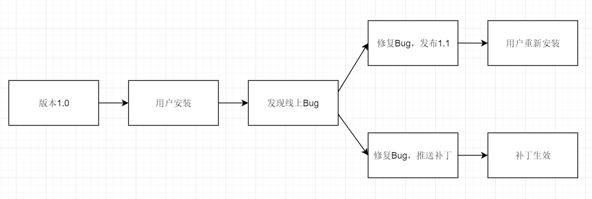
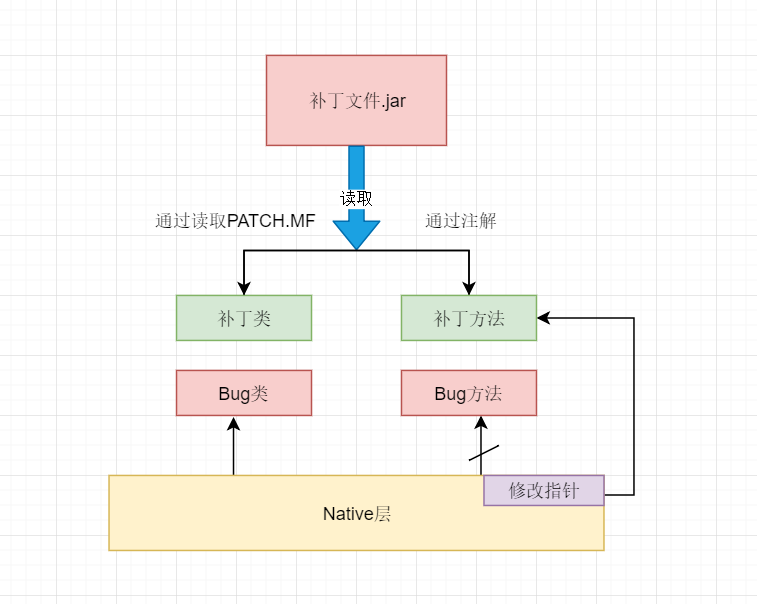
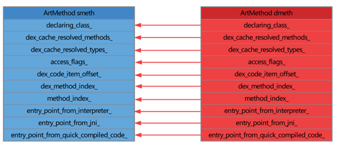
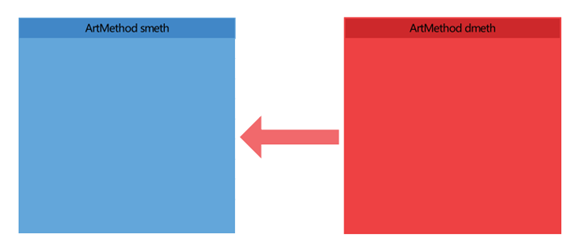
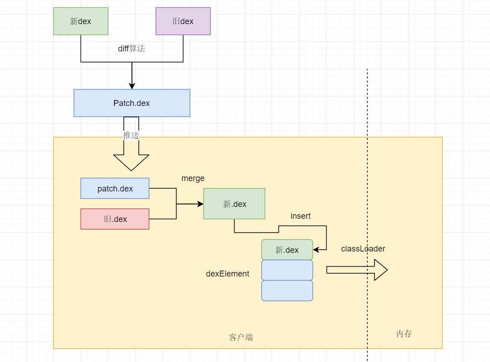
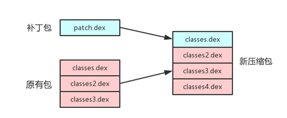
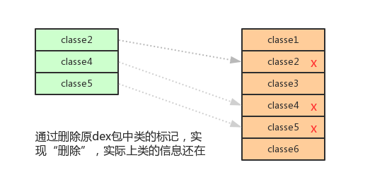

# Android热修复技术漫谈

<a name="df368884"></a>
# 前言
随着Android生态的高速发展，人们对App的要求也不断的提高，频繁的app更新不但耗费流量，也在耗费用户的耐心。但是既然写程序就自然免不了会出现Bug，那么如何在用户没有感知的情况下修复Bug呢，热修复或许是成本最低的一个方法。<br />Android中的热修复是指通过Android动态化的技术去替换用户本地中的有Bug的代码，其实现的方式往往是通过服务端向用户推送一个补丁包（App自己拉取），补丁包中包含了修复后的代码，并且可以替换掉之前的旧代码，从而避免了重新发布一个新apk的窘境。<br />
<a name="d93c4350"></a>
# Android中热修复的方向
我们知道Apk中并不只是有代码（dex文件），还有其他的资源文件、so文件。所以Bug也可能发生在除代码之外的地方，所以Android热修复的方向也就是针对这三种类型的Bug去做不同的修复处理。
* 代码修复

代码修复，顾名思义，就是通过一定的技术将发生Bug的代码替换成修复后的代码或者通过一些机制使系统执行不到错误的代码，转而去执行补丁中的代码。这也衍生出了代码修复的两大流派：底层替换方案和类加载方案。
* 资源修复

我们都知道Android中加载资源文件主要是通过AssertManager的addAssetPath方法进行加载的。所以资源修复也主要是在这方面上做文章，比如Android Studio的Instant Run就是通过构造一个新的AssertManager，将新的资源包通过addAssetPath加载进去，最后通过反射将所有对旧的资源的引用替换为对新的资源的引用。
* so文件修复

so文件修复的本质是对native方法的修复和替换。

**这篇文章主要讨论代码的修复。**

<a name="7b00a2d6"></a>
# 代码修复
大多数情况上来说，代码中出现Bug是开发中最为常见也最为致命的情况。而针对代码修复，如上所述，也出现了两种主要的流派：底层替换方案和类加载方案。
<a name="eb15b9d4"></a>
## 底层替换方案
底层替换方案是指在已经加载的类中的native层替换掉原有的方法，并指向修复后的方法。在Android的虚拟机(ART/DVM)中，每一个Java方法都在虚拟机中对应一个ArtMethod，而这个ArtMethod记录了这个Java方法的所有信息，包括所属类、访问权限、代码执行地址等。通过替换ArtMethod，对旧方法的调用就会被定向到新的方法中。<br />底层替换方案有两个代表性的框架——Andfix和Sophix，下面通过分别对分析他们的实现，描述底层替换方案的优势和劣势。
<a name="Andfix"></a>
### Andfix
Andfix是由阿里巴巴开源的一款Android热修复方案，它采用的策略是通过底层替换的方案实现的，其具体的执行流程可以表述为下图：<br /><br />可以看到，客户端在收到下发的补丁文件后，会将补丁类通过自带的classLoader加载进来，Andfix再通过PATCH.MF找出需要进行热修复的类，以及注解的方式找出需要修复的补丁方法，再通过修改native层的方法指针，使得对Bug方法的调用转化为对补丁方法的调用。<br />接下来继续分析Andfix是如何去修改native层的指针的。接下来看代码：
```cpp
static void replaceMethod(JNIEnv* env, jclass clazz, jobject src,
		jobject dest) {
	if (isArt) {
		art_replaceMethod(env, src, dest);
	} else {
		dalvik_replaceMethod(env, src, dest);
	}
}
```
这个是Andfix中replaceMethod方法对应的JNI方法，可以看到，它对不同的虚拟机有不同的处理情况，接下来以ART为例继续看下去：
```cpp
extern void __attribute__ ((visibility ("hidden"))) art_replaceMethod(
		JNIEnv* env, jobject src, jobject dest) {
    if (apilevel > 23) {
        replace_7_0(env, src, dest);
    } else if (apilevel > 22) {
		replace_6_0(env, src, dest);
	} else if (apilevel > 21) {
		replace_5_1(env, src, dest);
	} else if (apilevel > 19) {
		replace_5_0(env, src, dest);
    }else{
        replace_4_4(env, src, dest);
    }
}
```
这里是根据不同的API做了不同的处理，其实看到这里，我们应该能够猜到，Andfix对于不同版本的兼容性可以并不太好，尤其是Android是碎片化十分严重的一个生态，这个后面再进行分析。接下来以replace_6_0为例：

```cpp
void replace_6_0(JNIEnv* env, jobject src, jobject dest) {
	art::mirror::ArtMethod* smeth =
			(art::mirror::ArtMethod*) env->FromReflectedMethod(src);

	art::mirror::ArtMethod* dmeth =
			(art::mirror::ArtMethod*) env->FromReflectedMethod(dest);

    reinterpret_cast<art::mirror::Class*>(dmeth->declaring_class_)->class_loader_ =
    reinterpret_cast<art::mirror::Class*>(smeth->declaring_class_)->class_loader_; //for plugin classloader
    reinterpret_cast<art::mirror::Class*>(dmeth->declaring_class_)->clinit_thread_id_ =
    reinterpret_cast<art::mirror::Class*>(smeth->declaring_class_)->clinit_thread_id_;
    reinterpret_cast<art::mirror::Class*>(dmeth->declaring_class_)->status_ = reinterpret_cast<art::mirror::Class*>(smeth->declaring_class_)->status_-1;
    //for reflection invoke
    reinterpret_cast<art::mirror::Class*>(dmeth->declaring_class_)->super_class_ = 0;

    smeth->declaring_class_ = dmeth->declaring_class_;
    smeth->dex_cache_resolved_methods_ = dmeth->dex_cache_resolved_methods_;
    smeth->dex_cache_resolved_types_ = dmeth->dex_cache_resolved_types_;
    smeth->access_flags_ = dmeth->access_flags_ | 0x0001;
    smeth->dex_code_item_offset_ = dmeth->dex_code_item_offset_;
    smeth->dex_method_index_ = dmeth->dex_method_index_;
    smeth->method_index_ = dmeth->method_index_;
    
    smeth->ptr_sized_fields_.entry_point_from_interpreter_ =
    dmeth->ptr_sized_fields_.entry_point_from_interpreter_;
    
    smeth->ptr_sized_fields_.entry_point_from_jni_ =
    dmeth->ptr_sized_fields_.entry_point_from_jni_;
    smeth->ptr_sized_fields_.entry_point_from_quick_compiled_code_ =
    dmeth->ptr_sized_fields_.entry_point_from_quick_compiled_code_;
    
    LOGD("replace_6_0: %d , %d",
         smeth->ptr_sized_fields_.entry_point_from_quick_compiled_code_,
         dmeth->ptr_sized_fields_.entry_point_from_quick_compiled_code_);
}
```
这个方法可以分为两个部分：<br />第一部分的作用是通过Method对象获取到该方法对应的ArtMethod的地址，之后将这个地址转化为ArtMethod指针。<br />第二部分的作用则是替换原来的ArtMethd中的成员变量为新的ArtMethod的成员变量，其中就包括该java方法的代码执行地址，从而达到修复Bug的目的。其示意图如下：<br />
<a name="Sophix"></a>
### Sophix
在介绍Andfix的时候提到过，由于Android的开源性以及其碎片化严重，各种厂商可以修改Android的源代码。而Andfix中对ArtMethod的替换其实是根据公开的Android源码中的结构去进行编写的。所以一旦某个厂商对ArtMethod的结构进行了修改，就可能会导致热修复的失败。<br />而Sophix的实现很好地解决了这个问题。Sophix在底层方案上的实现思路其实是跟Andfix完全一致的，但是它不是通过替换ArtMethod中的成员变量，而是通过替换整个ArtMethod结构体。即：

```cpp
memcpy(smeth, dmeth, sizeof(ArtMethod));
```
<br />这样即使厂商对ArtMethod进行了更改，通过ArtMethod整个结构的替换也能把旧方法的成员自动对应的换成新方法的成员。
<a name="b5c7fbf8"></a>
### 底层替换方案的局限性
由于底层替换方案的原理，它存在以下两个局限性：
* 对原有类发生结构变化的修改是无法修复的（如对方法/属性进行增减）。由于在Dex文件的结构中，方法和属性是先以索引的方式排列的，一旦类的结构发生改变，Dex文件的结构也势必发生改变。而新旧类的结构不同导致新的方法使用旧的实例会产生不可预期的结果。
* 对非静态方法进行反射调用的情况是无法修复的。由于在对Method进行invole调用的时候，需要传入调用实例，这个是旧的类。但是这个反射方法对应的ArtMethod的declaring_class_已经被替换成了新的类，所以就会抛出IllegalArgumentException的异常。


<br />可以看到这些局限性出现的根本原因是因为底层替换方案没有对Dex文件进行重新的加载。但这其实也是它的优势之一。因为Java中并没有提供对类进行卸载的功能，所以要重新加载某个类，就需要重新启动App。而底层替换方案则没有这个限制，所以这也是它相较于后面的类加载方案的最大优点。<br />

<a name="2c965794"></a>
## 类加载方案
不同于底层替换方案，类加载方案一般是通过操作dex文件，将补丁中的dex文件与apk中的dex文件进行合成/替换，从而达到代码修复的目的。并且由于类加载方案往往不涉及native层的改动，所以其拥有更高的稳定性。但是由于java中并没有提供对类进行卸载的机制，所以此种类型的热修复方案往往需要重启应用，从而重新对类进行加载。
<a name="Tinker"></a>
### Tinker
Tinker是腾讯微信开源的一款基于类加载方案实现的热修复开源框架。其使用自研的dex差异算法生成体积很小的补丁包。客户端在接受到补丁包后，再将其和旧的dex文件进行合成，得到新的dex文件并将其插入到dexElement的第一个位置上。由于classLoader在启动时，会按顺序加载dexElement中的dex文件，这样修复类所在的全量dex包就会被优先加载，从而完成替换。<br /><br />Tinker方案的一个缺点就是由于patch包下发到客户端后是需要与本地的dex文件进行merge操作的，而这个merge操作是在Jvm上执行的，这样容易使应用的内存占用飙升，当发生OOM的时候会被Android的Memory killer杀掉。但同时有一个优点就是，由于Tinker是在加载的时候用合成包进行全量替换dex文件的，所以它很巧妙地规避了CLASS_ISPREVERIFIED异常的抛出。
<a name="Sophix"></a>
### Sophix
Sophix开源框架也提供了类加载方案的的代码修复方案。它会在底层替换方案无法完成的情况下（上面讨论的局限性）自动降级为类加载方案，从而提高热修复的成功率。<br />不同于Tinker方案，Sophix将类加载方案分为两种情况进行处理：
* Art虚拟机

由于Art虚拟机默认支持多dex加载，并且Art虚拟机会优先加载命名为classes.dex的文件。Sophix将补丁文件命名为classes.dex，并对原有dex文件进行排序。这样一来，art虚拟机就会先加载补丁文件，后续加载的同类名的类会被忽略，最后将加载得到的dexFile把dexElements整体替换。<br />

* Dvm虚拟机

Dvm虚拟机默认只加载命名为classes.dex文件，其他的dex文件都将被忽略。所以Sophix将补丁包中的类，在原有包中进行删除。但是这个删除并不是真正的删除，为了避免dex文件的结构被破坏，其只是将类的入口进行了删除，实际上类的信息还在dex包中。这样一来，冷启动后，原有的类就不会被加载。<br />
<a name="048f1245"></a>
## 两种方案的对比
在介绍这两个方案各自的实现的时候，已经对他们的优缺点进行了大概的提及，这里再次做一个总结：

|  | 底层替换方案 | 类加载方案 |
| --- | --- | --- |
| 优点 | 在类后，动态修改native指针，修复即时生效，无需冷启动加载 | 兼容性较好，能够修复的场景多 |
| 缺点 | 类已经被加载，内存中方法描述符（结构体）已经固定，所以只能替换，不能做新增修复。同时存在对不同机型的兼容问题 | 在合成全量补丁的时候存在性能问题，比如Tinker会开启一个service进行dex文件的合成，并且由于是进行全量更新，内存占用大，低端机上很可能修复失败。同时，修复后需要重启应用 |


