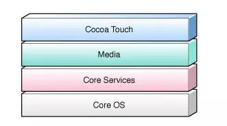

# CocoaTouch

Cocoa不是一种编程语言（它可以运行多种编程语言），它也不是一个开发工具（通过命令行我们仍然可以开发Cocoa程序），它是创建Mac OS X和IOS程序的原生面向对象API，为这两者应用提供了编程环境。

CocoaTouch主要包含了Foundation和UIKit框架，前者是框架的基础，和界面无关，其中包含了大量常用的API，后者则是基础的UI类库。



* CocoaTouch：这一层为我们提供了各种可用的框架，大部分跟UI有关，负责了用户在iOS设备上的触摸交互操作，包含的框架有：UIKit、GameKit、AddressUIKit

* Media：通过这一层我们可以进行音视频的录制，图形的绘制，以及动画的制作，包含的框架有：CoreGraphics、CoreAnimation、CoreText、AVFoundation

* Core Services：为应用程序提供基础的服务，包含的功能有：Foundation、CFNetwork、Location services、CoreLocation

* CoreOS：iOS系统架构最下面的一层，包括了内存管理，文件系统，电源管理等操作系统任务，直接和硬件设备进行交互，包含的结构有：Accelerate Framework、Security Framework、System


# app签名原理

1、简单版


直接由苹果后台使用私钥对App进行签名，将公钥内置在所有对ios设备中，这样安装后设备通过公钥解密。

2、双重签名

上面对简单版无法解决开发者调试对需求，每次安装都需要重新上传APP到后台进行签名，Apple通过使用双重签名解决了这个情况。


* 在你的Mac开发机器生成一对公私钥，这里称公钥L，私钥L。（L：Local）
* 苹果自己有固定的一对公私钥，跟上面AppStore例子一样，私钥在苹果后台，公钥内置在每个iOS设备上，这里称为公钥A，私钥A。（A：Apple）
* 把公钥L上传到苹果后台，用苹果后台里的私钥A去签名公钥L。得到一份数据包含了公钥L以及其签名，把这份数据称为证书。
* 在开发时，编译完一个App后，用本地的私钥L对这个App进行签名，同时把第三步得到的证书一起打包进App里，安装到手机。
* 在安装时，iOS系统取得证书，通过系统内置的公钥A，去验证证书的数字签名是否正确。
* 验证证书确保公钥L是苹果认证过的，再用公钥L去验证App的签名，这里就间接验证了这个App的安装行为是否经过苹果官方允许。（这里只验证安装行为，不验证App是否被改动，因为开发阶段App内容总是不断变化的，苹果不需要管）。

3、限定设备、权限

由于双重验证的方案只验证了开发者的公钥，所以可能会被滥用导致非开发App也能这样安装的情况。apple通过在证书中包含安装的设备ID列表和App对应的AppID等数据来解决这个问题。


4、最终版本

除了设备ID/AppID，还有其他信息也需要在这里用苹果签名，像App里iCloud、push、后台运行 等权限苹果都想控制，苹果把这些权限开关统称为Entitlements，它也需要通过签名去授权。

实际上一个证书本来就有规定的格式规范，上面我们把各种额外的信息塞入证书里是不合适的，于是苹果另外搞了一个东西，叫Provisioning Profile，一个Provisioning Profile里就包含了证书以及上述提到的所有额外信息，以及所有信息的签名。


总流程：

* 在你的 Mac 开发机器生成一对公私钥，这里称为公钥L，私钥L。L:Local
* 苹果自己有固定的一对公私钥，跟上面 AppStore 例子一样，私钥在苹果后台，公钥在每个iOS设备上。这里称为公钥A，私钥A。A:Apple
* 把公钥L传到苹果后台，用苹果后台里的私钥A去签名公钥L。得到一份数据包含了公钥L以及其签名，把这份数据称为证书。
* 在苹果后台申请AppID，配置好设备ID列表和APP可使用的权限，再加上第③步的证书，组成的数据用私钥A签名，把数据和签名一起组成一个Provisioning Profile文件，下载到本地Mac开发机。
* 在开发时，编译完一个APP后，用本地的私钥L对这个APP进行签名，同时把第④步得到的Provisioning Profile文件打包进APP里，文件名为 embedded.mobileprovision，把APP安装到手机上。
* 在安装时，iOS系统取得证书，通过系统内置的公钥A，去验证 embedded.mobileprovision的数字签名是否正确，里面的证书签名也会再验一遍。
* 确保了embedded.mobileprovision里的数据都是苹果授权以后，就可以取出里面的数据，做各种验证，包括用公钥L验证APP签名，验证设备ID是否在ID列表上，AppID是否对应得上，权限开关是否跟APP里的Entitlements对应等。

# 应用程序生命周期


# UIViewController的生命周期


# NavigationViewController

1、使用pushViewController跳转至下一页面

```
ViewController *v1 = [[ViewController alloc] init];
[self.navigationController pushViewController:v1 animated:true];
```

2、从当前页面返回到上一页面并传值过去

```
UIViewController *lastVlc = [self.navigationController.viewControllers objectAtIndex: self.navigationController.viewControllers.count - 2];
//设置回参
if ([lastVlc isKindOfClass:[ChooseThemeViewController class]]) {
    //XXXX
}
[self.navigationController popToViewController:lastVlc animated:true];
```

3、无需要传参数返回

```
[self.navigationController popViewControllerAnimated:true]
```

4、直接返回到root ViewController

```
[self.navigationController popToRootViewController］
```

5、返回到指定的ViewController

```
for (UIViewController *vcl in self.navigationController.viewControllers) {
    if ([vcl isKindOfClass:[ChooseThemeViewController class]]) {
        [self.navigationController popToViewController:vcl animated:true];
    }
}
```


