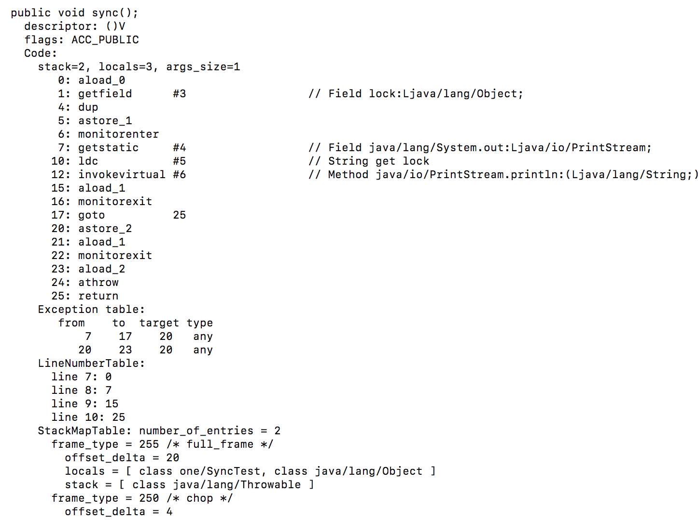
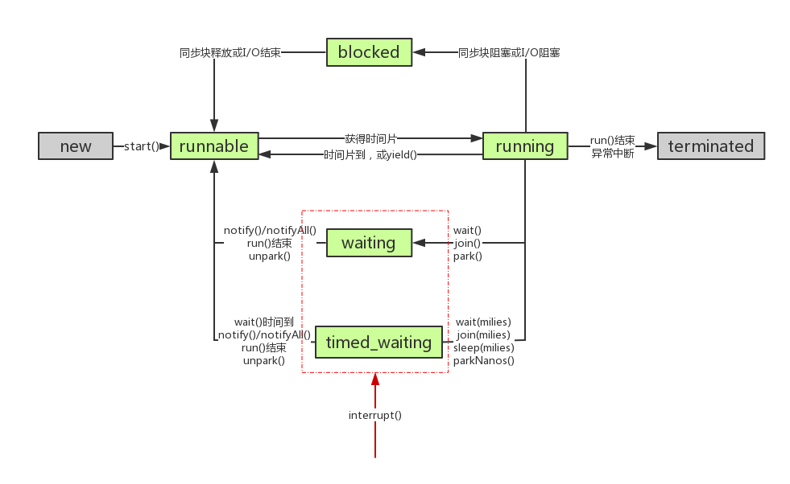

# Java的内存模型
当多线程操作同一个变量时，由于线程执行的顺序是不一样的，所以会出现如脏读、写丢失等现象。而之所以会出现这些现象，是由 Java 的内存模型决定。


如上图，每个Java线程都有自己对应的工作内存，它们存放着变量在主内存中的一个拷贝，在合适的时候通过 save 和 load 等操作向主内存同步信息。

因为以上的原因，在多个线程同时修改同一个变量的时候，会出现不确定的结果，从而导致了线程的不安全。而要保证线程安全，实现的思路也很简单，就是通过排队每次只让一个线程对变量进行修改，修改完毕后同步到主内存。而在Java中这个排队策略主要有两种实现方式：synchronized 和 reentrantlock。

# synchronized
synchronized，顾名思义，提供同步的语义，在java语言层面中，可以通过synchronized来控制不同的作用域，可以是类，可以是对象，可以是方法，可以是代码块。下面是使用的一个实例：
```
public class SyncTest {

    Object lock = new Object();

    public void sync(){

         synchronized (lock) {

             System.out.println("get lock");

         }
   }
}
```
可以看到，我们先创建了一个锁对象，然后通过 synchronized 关键字取获取这个锁，如果获取成功，就执行代码块。

更深入一步，synchronized 的实现是通过字节码指令去实现，可以利用Java自带的反编译工具（javap -v SyncTest.class）查看生成的字节码。



简单解析一下各个字节码的内容：

descriptor: ()V,这行是方法的说明，表示这个方法没有入参，返回类型是void

flags: ACC_PUBLIC,说明是public方法

code: 说明下面是方法代码区域

stack=2，locals=3，args_size=1,表示这个执行这个方法虚拟机栈深度只需要2，本地变量有3个，有1个参数，1个参数就是this(java方法的第一个参数都是this，只不过隐藏掉了)

aload_0:装载第一个局部变量到操作栈，这里就是this

getfield  #3 :#3指向常量池第三个位置，我没有贴出常量池的反编译视图，在这里就是代码中lock对象，整行指令意思就是访问这个lock对象的引用

dup:复制上面getfield获取的引用压入栈，这里就是lock的引用

astore_1:弹出栈顶的引用，然后放入局部变量1的位置中

monitorenter:得到lock对象的monitor，monitor的进入计数count+1，这个指令就是我们
Synchronized在jvm的底层实现，线程在打印之前需要得到lock的monitor，如果获取不到，则被挂起，获取到了就继续执行，在monitorenter下面，还有操作系统级别的 mutex重量级锁以及jvm利用cas优化的jvm级的轻量锁。

getstatic #4:访问静态变量System.out:PrintStream

ldc  #5:将常量池第5个常量“get lock”压入栈

invokevirtual #6:执行数据输出函数

aload_1:装载第二个局部变量，这里就是astore_1从栈上弹出的lock对象的引用

monitorexit:monitor的计数-1，因为是可重入的，就是一个线程可以多次拿到monitor，所以当monitor计数为0的时候释放lock锁。

goto 25:看一下25行是return，就是返回，如果代码正常执行，那么久流程就结束了，如果代码中间出现了异常，则继续走

astore_2:弹出栈顶引用，放到局部变量2

aload_1:装载第二个局部变量，这里就是astore_1从栈上弹出的lock对象的引用

monitorexit:monitor的计数-1，出现异常也释放掉锁。

aload_2:装载第三个局部变量，这里就是astore_2从栈顶弹出来的引用。

athrow:将栈顶的数据作为异常抛出，如果为null，则抛空指针异常

return:结束本方法调用的栈帧

## synchronized的底层优化
在Jvm底层对synchronized机制做了许多的优化。

### 自旋锁和自适应自旋
由于在锁的争抢过程中，没有成功获取到锁的线程会被阻塞。但是由于Java的线程模型是1：1的（在windows和linux上），即每个Java线程对应一个操作系统的核心线程。所以线程的挂起和唤醒操作都需要切换到内核态去完成。但是又因为共享数据的锁定状态只会持续很短的一段时间，为了这段时间去挂起和恢复线程并不值得。

基于以上的讨论，Jvm引入了自旋锁的优化技术。在线程获取锁失败的情况下，线程并不会马上挂起，而是先空转一段时间（使用一个空的for循环实现），但是由于这样会使cpu资源白白浪费，所以在自旋等待一段时间还没有获取到锁的情况下，线程还是会陷入核心态进行挂起操作。

而自适应自旋的意思则是，自旋的时间并不固定。对于一些锁对象，如果刚刚自旋成功，那么虚拟机认为这次自旋也很有可能成功，就会延长自旋的时间。而对于另一些锁，自旋很少成功获取过，那么以后再获取这个锁的时候可能忽略掉自旋的过程，以避免浪费处理及的资源。

### 轻量级锁
轻量级锁是相对于重量级锁而言的。使用轻量级锁时，不需要申请互斥量，仅仅将Mark Word中的部分字节CAS更新指向线程栈中的Lock Record，如果更新成功，则轻量级锁获取成功，记录锁状态为轻量级锁；否则，说明已经有线程获得了轻量级锁，再次判断Mark Word是否指向当前线程的栈帧，如果使说明当前线程已经拥有了这个对象的锁，那么可以直接进入同步快进行操作，否则说明这个对象锁已经被占用，目前发生了锁竞争（不适合继续使用轻量级锁），接下来膨胀为重量级锁。

上面说的Mark Word是虚拟机对象头的一部分，而Lock Record是当前线程的栈帧对于锁对象的Mark Word的一个拷贝。

Mark Word的结构如下：


### 偏向锁
在没有实际竞争的情况下，还能够针对部分场景继续优化。如果不仅仅没有实际竞争，自始至终，使用锁的线程都只有一个，那么，维护轻量级锁都是浪费的。偏向锁的目标是，减少无竞争且只有一个线程使用锁的情况下，使用轻量级锁产生的性能消耗。轻量级锁每次申请、释放锁都至少需要一次CAS，但偏向锁只有初始化时需要一次CAS。

“偏向”的意思是，偏向锁假定将来只有第一个申请锁的线程会使用锁（不会有任何线程再来申请锁），因此，只需要在Mark Word中CAS记录owner（本质上也是更新，但初始值为空），如果记录成功，则偏向锁获取成功，记录锁状态为偏向锁，以后当前线程等于owner就可以零成本的直接获得锁；否则，说明有其他线程竞争，膨胀为轻量级锁。

# Reentrantlock
Reentrantlock 是通过实现抽象类AbstractQueuedSynchronizer(AQS)来实现各种锁功能，比如乐观锁，悲观锁，互斥锁，共享锁，读写锁等。不同于synchronized关键字，Reentrantlock是以一个类的形式在jdk层面实现的锁机制。

## AbstractQueuedSynchronizer（AQS）
AQS提供了一种实现阻塞锁和一系列依赖FIFO等待队列的同步器的框架，它维护了一个volatile int state（代表共享资源）和一个FIFO线程等待队列（多线程争用资源被阻塞时会进入此队列）。


state的访问方式有三种:
* getState()
* setState()
* compareAndSetState()

其中compareAndSetState()又调用了UnSafe的compareAndSwapInt()方法

```
    protected final boolean compareAndSetState(int expect, int update) {
        // See below for intrinsics setup to support this
        return unsafe.compareAndSwapInt(this, stateOffset, expect, update);
    }
```

AQS同时提供了互斥模式（exclusive）和共享模式（shared）两种不同的同步逻辑。由于本篇文章主要是分析Reentrantlock的实现方式，而Reentrantlock是一种互斥的同步，所以下面分析AQS对于互斥模式的接口实现，即acquire和release方法

### 1.acquire
此方法是独占模式下线程获取共享资源的顶层入口。如果获取到资源，线程直接返回，否则进入等待队列，直到获取到资源为止，且整个过程忽略中断的影响。

```
    public final void acquire(int arg) {
        if (!tryAcquire(arg) &&
            acquireQueued(addWaiter(Node.EXCLUSIVE), arg))
            selfInterrupt();
    }

```

函数流程如下：

1. tryAcquire()尝试直接去获取资源，如果成功则直接返回；
2. addWaiter()将该线程加入等待队列的尾部，并标记为独占模式；
3. acquireQueued()使线程在等待队列中获取资源，一直获取到资源后才返回。如果在整个等待过程中被中断过，则返回true，否则返回false。

#### 1.1 tryAcquire
此方法尝试去获取独占资源。如果获取成功，则直接返回true，否则直接返回false。

```
    protected boolean tryAcquire(int arg) {
        throw new UnsupportedOperationException();
    }
```

可以看到这里是直接抛出异常，因为AQS只是一个框架，具体的实现方式需要自定义同步器去实现（通过state的三个操作函数），并且不同的同步器其获取锁的策略也不同（能否重入）。

这里之所以没有定义成abstract，是因为独占模式下只用实现tryAcquire-tryRelease，而共享模式下只用实现tryAcquireShared-tryReleaseShared。如果都定义成abstract，那么每个模式也要去实现另一模式下的接口。

#### addWaiter
此方法用于将当前线程加入到等待队列的队尾，并返回当前线程所在的结点。
```
    /**
     * Creates and enqueues node for current thread and given mode.
     *
     * @param mode Node.EXCLUSIVE for exclusive, Node.SHARED for shared
     * @return the new node
     */
    private Node addWaiter(Node mode) {
        Node node = new Node(Thread.currentThread(), mode);
        // Try the fast path of enq; backup to full enq on failure
        Node pred = tail;
        if (pred != null) {
            node.prev = pred;
            if (compareAndSetTail(pred, node)) {
                pred.next = node;
                return node;
            }
        }
        enq(node);
        return node;
    }
```

第一步通过CAS操作尝试快速插入队尾，如果发生竞争则通过enq()入队。

Node结点是对每一个访问同步代码的线程的封装，其包含了需要同步的线程本身以及线程的状态，如是否被阻塞，是否等待唤醒，是否已经被取消等。变量waitStatus则表示当前被封装成Node结点的等待状态，共有4种取值CANCELLED、SIGNAL、CONDITION、PROPAGATE。

* CANCELLED：值为1，在同步队列中等待的线程等待超时或被中断，需要从同步队列中取消该Node的结点，其结点的waitStatus为CANCELLED，即结束状态，进入该状态后的结点将不会再变化。

* SIGNAL：值为-1，被标识为该等待唤醒状态的后继结点，当其前继结点的线程释放了同步锁或被取消，将会通知该后继结点的线程执行。说白了，就是处于唤醒状态，只要前继结点释放锁，就会通知标识为SIGNAL状态的后继结点的线程执行。

* CONDITION：值为-2，与Condition相关，该标识的结点处于等待队列中，结点的线程等待在Condition上，当其他线程调用了Condition的signal()方法后，CONDITION状态的结点将从等待队列转移到同步队列中，等待获取同步锁。

* PROPAGATE：值为-3，与共享模式相关，在共享模式中，该状态标识结点的线程处于可运行状态。

* 0状态：值为0，代表初始化状态。

AQS在判断状态时，通过用waitStatus>0表示取消状态，而waitStatus<0表示有效状态。

##### end
```
    private Node enq(final Node node) {
        for (;;) {
            Node t = tail;
            if (t == null) { // Must initialize
                if (compareAndSetHead(new Node()))
                    tail = head;
            } else {
                node.prev = t;
                if (compareAndSetTail(t, node)) {
                    t.next = node;
                    return t;
                }
            }
        }
    }
```
end()方法的作用是将node加入队尾。其使用了for循环自旋的方式，通过CAS操作将node插入队尾，当然，如果队列为空，先创建一个空的标志结点作为head结点，并将tail也指向它。

#### acquireQueued
通过tryAcquire()和addWaiter()，该线程获取资源失败，已经被放入等待队列尾部了。而acquireQueued()方法则是线程将自己挂起，等待先驱唤醒自己，或者被interrupt。
```
/**
     * Acquires in exclusive uninterruptible mode for thread already in
     * queue. Used by condition wait methods as well as acquire.
     *
     * @param node the node
     * @param arg the acquire argument
     * @return {@code true} if interrupted while waiting
     */
    final boolean acquireQueued(final Node node, int arg) {
        boolean failed = true;//标记是否成功拿到资源
        try {
            boolean interrupted = false;
            for (;;) { //自旋
                final Node p = node.predecessor();//拿到前驱
                if (p == head && tryAcquire(arg)) { //如果前驱是头节点，则说明现在自己处于第二个，很大概率可以获取到锁
                //获取成功
                    setHead(node);//拿到资源后，将head指向该结点。所以head所指的标杆结点，就是当前获取到资源的那个结点或null。
                    p.next = null; // help GC
                    failed = false;
                    return interrupted;//返回等待过程中是否被中断过
                }
                //如果自己可以休息了，就进入waiting状态，直到被unpark()
                if (shouldParkAfterFailedAcquire(p, node) &&
                    parkAndCheckInterrupt())
                    interrupted = true;//如果等待过程中被中断过，哪怕只有那么一次，就将interrupted标记为true
            }
        } finally {
            if (failed)
                cancelAcquire(node);
        }
    }
```

##### shouldParkAfterFailedAcquire
这个方法的作用是检查前驱节点的waitStatus，判断自己是否可以进入waiting状态（前面的节点可能是CANCEL状态的）。
```
 /**
     * Checks and updates status for a node that failed to acquire.
     * Returns true if thread should block. This is the main signal
     * control in all acquire loops.  Requires that pred == node.prev.
     *
     * @param pred node's predecessor holding status
     * @param node the node
     * @return {@code true} if thread should block
     */
    private static boolean shouldParkAfterFailedAcquire(Node pred, Node node) {
        int ws = pred.waitStatus;
        if (ws == Node.SIGNAL)
            /*
             * This node has already set status asking a release
             * to signal it, so it can safely park.
             */
            return true;
        if (ws > 0) {
            /*
             * Predecessor was cancelled. Skip over predecessors and
             * indicate retry.
             */
            do {
                node.prev = pred = pred.prev;
            } while (pred.waitStatus > 0);
            pred.next = node;
        } else {
            /*
             * waitStatus must be 0 or PROPAGATE.  Indicate that we
             * need a signal, but don't park yet.  Caller will need to
             * retry to make sure it cannot acquire before parking.
             */
             //将前驱的状态设置为SIGNAL
            compareAndSetWaitStatus(pred, ws, Node.SIGNAL);
        }
        return false;
    }
```

##### parkAndCheckInterrupt
这个方法的作用就是调用park()方法，让线程进入waiting状态。
```
    /**
     * Convenience method to park and then check if interrupted
     *
     * @return {@code true} if interrupted
     */
    private final boolean parkAndCheckInterrupt() {
        LockSupport.park(this); //调用park()使线程进入waiting状态
        return Thread.interrupted();//如果被唤醒，查看自己是不是被中断的。
    }
```
park()会让当前线程进入waiting状态。在此状态下，有两种途径可以唤醒该线程：1）被unpark()；2）被interrupt()。

##### acquireQueued方法小结
总结下acquireQueued的具体流程：

* 结点进入队尾后，检查状态，找到安全休息点；
* 调用park()进入waiting状态，等待unpark()或interrupt()唤醒自己；
* 被唤醒后，继续尝试tryAcquire获取锁，如果失败，继续上面的流程。

### acquire方法小结
总结下acquire的具体流程：

* 调用自定义同步器的tryAcquire()尝试直接去获取资源，如果成功则直接返回；
* 没成功，则addWaiter()将该线程加入等待队列的尾部，并标记为独占模式；
* acquireQueued()使线程在等待队列中休息，有机会时（轮到自己，会被unpark()）会去尝试获取资源。获取到资源后才返回。如果在整个等待过程中被中断过，则返回true，否则返回false。
* 如果线程在等待过程中被中断过，它是不响应的。只是获取资源后才再进行自我中断selfInterrupt()，将中断补上。

下面是流程图：


### 2.release
此方法是独占模式下线程释放共享资源的顶层入口。它会释放指定量的资源，如果彻底释放了（即state=0）,它会唤醒等待队列里的其他线程来获取资源。
```
    /**
     * Releases in exclusive mode.  Implemented by unblocking one or
     * more threads if {@link #tryRelease} returns true.
     * This method can be used to implement method {@link Lock#unlock}.
     *
     * @param arg the release argument.  This value is conveyed to
     *        {@link #tryRelease} but is otherwise uninterpreted and
     *        can represent anything you like.
     * @return the value returned from {@link #tryRelease}
     */
    public final boolean release(int arg) {
        if (tryRelease(arg)) {
            Node h = head; //找到头结点
            if (h != null && h.waitStatus != 0)
                unparkSuccessor(h);//唤醒等待队列里的下一个线程
            return true;
        }
        return false;
    }
```
release方法根据tryRelease方法判断该线程是否已经完成释放资源

#### tryRelease
```
    protected boolean tryRelease(int arg) {
        throw new UnsupportedOperationException();
    }
```
可以看到，tryRelease是根据不同的同步器去定制的。tryRelease()都会成功的，因为这是独占模式，该线程来释放资源，那么它肯定已经拿到独占资源了，直接减掉相应量的资源即可(state-=arg)，也不需要考虑线程安全的问题。

#### unparkSuccessor
此方法用于唤醒等待队列中下一个线程。
```
private void unparkSuccessor(Node node) {
        /*
         * If status is negative (i.e., possibly needing signal) try
         * to clear in anticipation of signalling.  It is OK if this
         * fails or if status is changed by waiting thread.
         */
        int ws = node.waitStatus;
        if (ws < 0)
            compareAndSetWaitStatus(node, ws, 0);

        /*
         * Thread to unpark is held in successor, which is normally
         * just the next node.  But if cancelled or apparently null,
         * traverse backwards from tail to find the actual
         * non-cancelled successor.
         */
        Node s = node.next;
        if (s == null || s.waitStatus > 0) {
            s = null;
            for (Node t = tail; t != null && t != node; t = t.prev)
                if (t.waitStatus <= 0)
                    s = t;
        }
        if (s != null)
            LockSupport.unpark(s.thread);
    }
```
主要是通过unpark()唤醒等待队列中最前边的那个未放弃线程

## AQS小结
至此，AQS的互斥模式已经分析完了，总体的流程就是通过CAS操作加上自旋的方式去获取state来实现的。这跟
synchronized的优化方向是一致的。

## Reentrantlock分析
首先，Reentrantlock的基本使用如下：
```
        ReentrantLock lock = new ReentrantLock();
        try {
            lock.lock();

        } finally {
            lock.unlock();
        }
```

其实Reentrantlock是基于AQS实现的同步器，所以它大部分的代码是实现上面说的tryLock和tryRelease方法。

### lock
lock方法是Reentrantlock获取资源的入口。

```
    public void lock() {
        sync.lock();
    }

```
直接调用了sync.lock方法，这里插一下，Reentrantlock分为公平锁和非公平锁两种模式，其区别就是公平锁就是保障了多线程下各线程获取锁的顺序，先到的线程优先获取锁，而非公平锁则无法提供这个保障。

synchronized 是可重入的非公平锁，而Reentrantlock的默认构造实现也是可重入的非公平锁。

```
    public ReentrantLock() {
        sync = new NonfairSync();
    }
```

所以下面主要分析非公平锁的情况。

### NonfairSync.lock
继续回到代码，上面的sync在非公平锁模式下，其实就是NonfairSync。

```
        final void lock() {
            if (compareAndSetState(0, 1))
                setExclusiveOwnerThread(Thread.currentThread());
            else
                acquire(1);
        }
```

lock方法首先会用CAS获取一次锁，(CAS操作线程安全，因为通过jni直接调用的操作系统cmpxchg指令,(如果是多核CPU，则需要调用lock cmpxchg利用内存屏障来保障指令的原子性)如果成功了，则设置当前线程占有这个锁。否则，调用调用acquire()方法进入锁申请流程。这时候调用链就回到了AQS的acquire()方法，之前提过，这里同步器需要实现tryAcquire()方法。

### NonfairSync.tryAcquire
```
        protected final boolean tryAcquire(int acquires) {
            return nonfairTryAcquire(acquires);
        }
```

```
        /**
         * Performs non-fair tryLock.  tryAcquire is implemented in
         * subclasses, but both need nonfair try for trylock method.
         */
        final boolean nonfairTryAcquire(int acquires) {
            final Thread current = Thread.currentThread();
            int c = getState();
            if (c == 0) {
                if (compareAndSetState(0, acquires)) {
                    setExclusiveOwnerThread(current);
                    return true;
                }
            }
            else if (current == getExclusiveOwnerThread()) {
                int nextc = c + acquires;
                if (nextc < 0) // overflow
                    throw new Error("Maximum lock count exceeded");
                setState(nextc);
                return true;
            }
            return false;
        }
```

首先获取一下state，如果是0则说明还没占有锁，则再去CAS获取一次，意图是代码从外面的CAS走到这的时间里，可能别的线程已经释放了锁，所以在进行一次CAS，如果获取到了则返回成功。如果state不是0，且占有锁的线程是当前线程，因为是可重入的锁，则在计数上加1，代表重入一次，等到时候释放锁的时候，要全部释放完等计数为0才表示释放完全。

如果都不是以上情况，则返回false。

### lock小结
由于Reentrantlock是可重入锁，所以它的tryAcquire会对state记录重入的次数，在release的时候也需要release相应的次数。

### unlock
unlock方法表示对资源的释放。
```
    public void unlock() {
        sync.release(1);
    }
```
和lock类似的过程，直接进入NonfairSync.tryRelease

### NonfairSync.tryRelease
```
        protected final boolean tryRelease(int releases) {
            int c = getState() - releases;
            if (Thread.currentThread() != getExclusiveOwnerThread())
                throw new IllegalMonitorStateException();
            boolean free = false;
            if (c == 0) {
                free = true;
                setExclusiveOwnerThread(null);
            }
            setState(c);
            return free;
        }
```
由于Reentrantlock的可重入特性，tryRelease会判断当前state是否已经被release到值为0，如果值为0，当前线程释放锁成功，进入AQS流程。

否则，还需要继续释放直至state为0。

## Reentrantlock小结
Reentrantlock的实现其实就是AQS互斥模式的基础上复写了tryAcquire和tryRelease方法，使其拥有了可重入的能力。

# Reentrantlock和synchronized对比
**性能上：**

在Synchronized优化以前，synchronized的性能是比ReenTrantLock差很多的，但是自从Synchronized引入了偏向锁，轻量级锁（自旋锁）后，两者的性能就差不多了，在两种方法都可用的情况下，官方甚至建议使用synchronized，其实synchronized的优化我感觉就借鉴了ReenTrantLock中的CAS技术。都是试图在用户态就把加锁问题解决，避免进入内核态的线程阻塞。

**功能上：**

便利性：很明显Synchronized的使用比较方便简洁，并且由编译器去保证锁的加锁和释放，而ReenTrantLock需要手工声明来加锁和释放锁，为了避免忘记手工释放锁造成死锁，所以最好在finally中声明释放锁。

锁的细粒度和灵活度：很明显ReenTrantLock优于Synchronized

**ReenTrantLock独有的能力**

* ReenTrantLock可以指定是公平锁还是非公平锁。而synchronized只能是非公平锁。

* ReenTrantLock提供了一个Condition（条件）类，用来实现分组唤醒需要唤醒的线程们，而不是像synchronized要么随机唤醒一个线程要么唤醒全部线程。

* ReenTrantLock提供了一种能够中断等待锁的线程的机制，通过lock.lockInterruptibly()来实现这个机制。

# 附录
线程状态变更图：




# 参考
[浅谈偏向锁、轻量级锁、重量级锁](https://www.jianshu.com/p/36eedeb3f912)

[java两种同步机制的实现 synchronized和reentrantlock](https://www.cnblogs.com/diegodu/p/7998337.html)

[Java并发之AQS详解](https://www.cnblogs.com/waterystone/p/4920797.html)