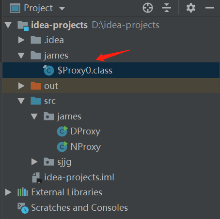

# Java动态代理机制分析

<a name="eb1dfda7"></a>
# 代理模式
代理模式的定义是为其他对象提供一种代理以控制对这个对象的访问。一般我们使用代理模式对系统做一些验权的工作或者暴露出AOP的切口等。

<a name="0de41b4b"></a>
# 静态代理
静态代理是指代理类在编译前已经确定，在java中我们通常会这样实现一个静态代理：

* 定义行为接口

```java
    interface Subject {
        void request();
    }
```

* 定义实际行为类（被代理类）

```java
    static class SubjectImpl implements Subject{
        @Override
        public void request() {
            System.out.println("request");
        }
    }
```

* 定义代理类

```java
    static class ProxySubject implements Subject {

        private Subject realSubject;

        public ProxySubject(Subject realSubject) {
            this.realSubject = realSubject;
        }

        @Override
        public void request() {
            System.out.println("before request");
            realSubject.request();
            System.out.println("after request");
        }
    }
```

* 调用过程

```java
    public static void main(String[] args) {
        Subject realSubject = new SubjectImpl();
        Subject proxySubject = new ProxySubject(realSubject);
        proxySubject.request();
    }
```

* 类图


* 总结

可以看到，静态代理的实现比较简单，但是其也有着显著的缺点：
  * 代码维护比较困难。被代理类和代理类都实现了同一个接口，当接口需要进行变更的时候（如增加方法），代理类和被代理类都需要进行相应的变更。
  * 代理类与接口是一对一的关系。如上面的UMl图中，如果增加一个Subject2接口，则需要增加新的代理类。并且当需要为不同的实现类代理不同的方法，会使代理类的数量变多或者使代理类的结构变得复杂。比如需要为SubjectImpl1、SubjectImpl2、SubjectImpl3分别代理request1、request2、request3三个方法，有两种方案：
    * 增加代理类：Proxy1.request1()、Proxy2.request2()、Proxy3.request3()
    * 复杂化代理类：在代理类中注入三个对象SubjectImpl1、SubjectImpl2、SubjectImpl3，根据不同的方法调用不同的对象：SubjectImpl1.request1()、SubjectImpl2.request()2、SubjectImpl3.request()3

<a name="39d8ec08"></a>
# 动态代理
Java中的动态代理是指代理类在运行过程中才被生成。动态代理通过操纵字节码生成代理类，并通过反射调用代理方法，可以优雅地解决上面静态代理的两个问题。比如android的网络请求框架retrofit就是通过泛型加动态代理来解决为不同的请求接口提供统一的配置代理。
* retrofit中的动态代理：

```java
ApiStores apiStores = Retrofit retrofit = new Retrofit.Builder()
    .baseUrl("https://api.github.com/")
    .build();
		.create(ApiStores.class);

public <T> T create(final Class<T> service) {
    Utils.validateServiceInterface(service);
    if (validateEagerly) {
      eagerlyValidateMethods(service);
    }
    return (T) Proxy.newProxyInstance(service.getClassLoader(), new Class<?>[] { service },
        new InvocationHandler() {
          private final Platform platform = Platform.get();

          @Override public Object invoke(Object proxy, Method method, Object... args)
              throws Throwable {
            // If the method is a method from Object then defer to normal invocation.
            if (method.getDeclaringClass() == Object.class) {
              return method.invoke(this, args);
            }
            if (platform.isDefaultMethod(method)) {
              return platform.invokeDefaultMethod(method, service, proxy, args);
            }
            ServiceMethod serviceMethod = loadServiceMethod(method);
            OkHttpCall okHttpCall = new OkHttpCall<>(serviceMethod, args);
            return serviceMethod.callAdapter.adapt(okHttpCall);
          }
        });
  }
```

可以看到，retrofit通过传入的Class对象作为返回的代理对象，这个代理对象通过将职责转移到ServiceMethod中（被代理类，但是执行的不是跟代理类的同名方法，而是具体发送网络请求的方法，这里retrofit只是通过动态代理对请求接口的方法做一个收口，然后通过反射获取注解的值去拼接http请求参数），从而达到对不同的接口进行统一配置的目的。

下面更为具体地介绍一下动态代理的使用流程：
* 定义接口

```java
    interface Subject {
        void request();
    }
```

* 创建实现类

```java
    static class SubjectImpl implements Subject{

        @Override
        public void request() {
            System.out.println("real request");
        }
    }
```

* 创建InvocationHandler对象。InvocationHandler对象的作用是在进行调用之前或者之后的一些切面处理，比如打印日志、鉴权等。代理类的每个方法调用都会被收口到invoke方法中，所以一般的做法是在invoke方法中通过反射去调用被代理类的实现方法。

```java
    static class ProxyHandler implements InvocationHandler {

        private Object target;

        public ProxyHandler(Object target) {
            this.target = target;
        }

        @Override
        public Object invoke(Object proxy, Method method, Object[] args) throws Throwable {
            System.out.println("before " + method.getName());
            Object result = method.invoke(target, args);
            System.out.println("after " + method.getName());
            return result;
        }
    }
```

* 调用过程。调用的过程其实分为创建代理类和进行方法调用两个部分。我们可以通过Proxy.newProxyInstance方法动态地创建一个代理类。Proxy.newProxyInstance需要传入代理类的classLoader对象，代理类实现的接口（据此创建对应的代理方法）、以及之前创建的InvocationHandler对象。

```java
    public static void main(String[] args) {
        Subject subject = new SubjectImpl();
        InvocationHandler proxyHandler = new ProxyHandler(subject);
        Subject proxySubject = (Subject) Proxy.newProxyInstance(SubjectImpl.class.getClassLoader(),
                SubjectImpl.class.getInterfaces(),
                proxyHandler);
        proxySubject.request();
    }
```

<a name="ee70c985"></a>
# 动态代理实现原理
上面说到动态代理是在运行期动态生成代理类，那么接下来分析一下生成的代理类长什么样，以及是怎样被生成出来的。

首先来看一下生成的代理类长什么样。通过idea，可以将动态代理生成的代理类保存下来。

* 在main函数开头加上这一行代码：

```java
System.getProperties().put("sun.misc.ProxyGenerator.saveGeneratedFiles","true");
```

* 运行工程后可以在根目录的项目同包名文件夹中找到生成的class文件。



* 生成的代理类如下。可以看到生成的代理类跟静态代理中我们自己实现的代理类类似，也实现了相同的Subject接口。但是不同的是，动态代理类还继承了Proxy，并把所有方法的调用都转移到了Proxy的变量h中，这个h即为我们传入的InvocationHandler对象。在对象的初始化阶段中，通过静态代码块获取到接口以及Object中方法描述(Method)对象，并传给InvocationHandler，供其调用。

```java
//
// Source code recreated from a .class file by IntelliJ IDEA
// (powered by Fernflower decompiler)
//

package james;

import james.DProxy.Subject;
import java.lang.reflect.InvocationHandler;
import java.lang.reflect.Method;
import java.lang.reflect.Proxy;
import java.lang.reflect.UndeclaredThrowableException;

final class $Proxy0 extends Proxy implements Subject {
    private static Method m1;
    private static Method m2;
    private static Method m3;
    private static Method m0;

    public $Proxy0(InvocationHandler var1) throws  {
        super(var1);
    }

    public final boolean equals(Object var1) throws  {
        try {
            return (Boolean)super.h.invoke(this, m1, new Object[]{var1});
        } catch (RuntimeException | Error var3) {
            throw var3;
        } catch (Throwable var4) {
            throw new UndeclaredThrowableException(var4);
        }
    }

    public final String toString() throws  {
        try {
            return (String)super.h.invoke(this, m2, (Object[])null);
        } catch (RuntimeException | Error var2) {
            throw var2;
        } catch (Throwable var3) {
            throw new UndeclaredThrowableException(var3);
        }
    }

    public final void request() throws  {
        try {
            super.h.invoke(this, m3, (Object[])null);
        } catch (RuntimeException | Error var2) {
            throw var2;
        } catch (Throwable var3) {
            throw new UndeclaredThrowableException(var3);
        }
    }

    public final int hashCode() throws  {
        try {
            return (Integer)super.h.invoke(this, m0, (Object[])null);
        } catch (RuntimeException | Error var2) {
            throw var2;
        } catch (Throwable var3) {
            throw new UndeclaredThrowableException(var3);
        }
    }

    static {
        try {
            m1 = Class.forName("java.lang.Object").getMethod("equals", Class.forName("java.lang.Object"));
            m2 = Class.forName("java.lang.Object").getMethod("toString");
            m3 = Class.forName("james.DProxy$Subject").getMethod("request");
            m0 = Class.forName("java.lang.Object").getMethod("hashCode");
        } catch (NoSuchMethodException var2) {
            throw new NoSuchMethodError(var2.getMessage());
        } catch (ClassNotFoundException var3) {
            throw new NoClassDefFoundError(var3.getMessage());
        }
    }
}
```

* 根据上面的描述，可以总结一下动态代理的结构如下：

<br />接下来分析动态代理类的生成过程。

* 代理类的生成入口在Proxy.newProxyInstance方法中，其过程主要分为四个部分：权限检查、获取/生成代理类、反射获取代理类实例。

```java
public static Object newProxyInstance(ClassLoader loader,
                                          Class<?>[] interfaces,
                                          InvocationHandler h)
        throws IllegalArgumentException
    {
        Objects.requireNonNull(h);

        final Class<?>[] intfs = interfaces.clone();
        final SecurityManager sm = System.getSecurityManager();
        if (sm != null) {
            checkProxyAccess(Reflection.getCallerClass(), loader, intfs);
        }

        /*
         * Look up or generate the designated proxy class.
         */
        Class<?> cl = getProxyClass0(loader, intfs);

        /*
         * Invoke its constructor with the designated invocation handler.
         */
        try {
            if (sm != null) {
                checkNewProxyPermission(Reflection.getCallerClass(), cl);
            }

            final Constructor<?> cons = cl.getConstructor(constructorParams);
            final InvocationHandler ih = h;
            if (!Modifier.isPublic(cl.getModifiers())) {
                AccessController.doPrivileged(new PrivilegedAction<Void>() {
                    public Void run() {
                        cons.setAccessible(true);
                        return null;
                    }
                });
            }
            return cons.newInstance(new Object[]{h});
        } catch (IllegalAccessException|InstantiationException e) {
            throw new InternalError(e.toString(), e);
        } catch (InvocationTargetException e) {
            Throwable t = e.getCause();
            if (t instanceof RuntimeException) {
                throw (RuntimeException) t;
            } else {
                throw new InternalError(t.toString(), t);
            }
        } catch (NoSuchMethodException e) {
            throw new InternalError(e.toString(), e);
        }
    }
```

  * 权限检查：权限检查主要分别两个部分：
    * 第一部分是该应用是否有SecurityManager的“getClassLoader”权限。SecurityManager是Java给应用程序用于配置安全策略的类。其默认的配置文件路径为：$JAVA_HOME/jre/lib/security/java.policy，当然也可以自己指定配置文件。这里不过多解释。
    * 第二部分是传入的ClassLoader是否有实现接口的包访问权限。所以一般我们调用newProxyInstance都会传入具体实现类的ClassLoader，因为实现类的ClassLoader是肯定有它实现接口的包访问权限的。
  * 获取/生成代理类：Proxy用一个WeakCache来存储，看名字可以知道，它是一个带有弱引用缓存功能的数据结构。这里直接看代理类的生成过程。

<br />在调用了newProxyInstance后，如果WeakCache中没有缓存，则会调用ProxyClassFactory的apply方法去生成Class字节码。而在apply方法中，也会做一些安全性的校验，主要是防止生成出的字节码不符合规范（比如一个接口实现多次）。在校验完后，apply中又会调用ProxyGenerator的generateProxyClass方法进行byte[]数组的写入，即将需要生成的代理类写成byte[]数组。generateProxyClass方法会调用创建ProxyGenerator对象并调用generateClassFile方法真正写入byte[]数组。

```java
 public static byte[] generateProxyClass(final String var0, Class<?>[] var1, int var2) {
        ProxyGenerator var3 = new ProxyGenerator(var0, var1, var2);
        final byte[] var4 = var3.generateClassFile();
        if (saveGeneratedFiles) {
            AccessController.doPrivileged(new PrivilegedAction<Void>() {
                public Void run() {
                    try {
                        int var1 = var0.lastIndexOf(46);
                        Path var2;
                        if (var1 > 0) {
                            Path var3 = Paths.get(var0.substring(0, var1).replace('.', File.separatorChar));
                            Files.createDirectories(var3);
                            var2 = var3.resolve(var0.substring(var1 + 1, var0.length()) + ".class");
                        } else {
                            var2 = Paths.get(var0 + ".class");
                        }

                        Files.write(var2, var4, new OpenOption[0]);
                        return null;
                    } catch (IOException var4x) {
                        throw new InternalError("I/O exception saving generated file: " + var4x);
                    }
                }
            });
        }

        return var4;
    }
```

这里可以看到，如果saveGeneratedFiles为true的话，就会生成一个.class文件，这也是前面的System.getProperties().put("sun.misc.ProxyGenerator.saveGeneratedFiles","true")为什么会生成.class文件的原因，即将saveGeneratedFiles设置为true。

而具体生成byte[]的过程可以看下面的代码，它的过程也就是把需要写入信息整理后，然后以writeShort的方式写入到byte数组中。

```java
            ByteArrayOutputStream var13 = new ByteArrayOutputStream();
            DataOutputStream var14 = new DataOutputStream(var13);
						try {
                var14.writeInt(-889275714);
                var14.writeShort(0);
                var14.writeShort(49);
                this.cp.write(var14);
                var14.writeShort(this.accessFlags);
                var14.writeShort(this.cp.getClass(dotToSlash(this.className)));
                var14.writeShort(this.cp.getClass("java/lang/reflect/Proxy"));
                var14.writeShort(this.interfaces.length);
                Class[] var17 = this.interfaces;
                int var18 = var17.length;

                for(int var19 = 0; var19 < var18; ++var19) {
                    Class var22 = var17[var19];
                    var14.writeShort(this.cp.getClass(dotToSlash(var22.getName())));
                }

                var14.writeShort(this.fields.size());
                var15 = this.fields.iterator();

                while(var15.hasNext()) {
                    ProxyGenerator.FieldInfo var20 = (ProxyGenerator.FieldInfo)var15.next();
                    var20.write(var14);
                }

                var14.writeShort(this.methods.size());
                var15 = this.methods.iterator();

                while(var15.hasNext()) {
                    ProxyGenerator.MethodInfo var21 = (ProxyGenerator.MethodInfo)var15.next();
                    var21.write(var14);
                }

                var14.writeShort(0);
                return var13.toByteArray();
            } catch (IOException var9) {
                throw new InternalError("unexpected I/O Exception", var9);
            }
```

在得到byte[]数组后，ProxyClassFactory的apply方法会调用_defineClass0_方法将byte[]转化为字节码，这是个native方法。其生成的过程就是ClassLoader加载二进制文件的过程。

```java
            try {
                return defineClass0(loader, proxyName,
                                    proxyClassFile, 0, proxyClassFile.length);
            } catch (ClassFormatError e) {
                /*
                 * A ClassFormatError here means that (barring bugs in the
                 * proxy class generation code) there was some other
                 * invalid aspect of the arguments supplied to the proxy
                 * class creation (such as virtual machine limitations
                 * exceeded).
                 */
                throw new IllegalArgumentException(e.toString());
            }
```

  * 反射获取代理类实例。通过反射获取代理类的实例就比较简单了，直接获取到类的构造函数，再将传入的InvocationHandler对象作为参数并调用就可以了。

```java
			try {
            if (sm != null) {
                checkNewProxyPermission(Reflection.getCallerClass(), cl);
            }

            final Constructor<?> cons = cl.getConstructor(constructorParams);
            final InvocationHandler ih = h;
            if (!Modifier.isPublic(cl.getModifiers())) {
                AccessController.doPrivileged(new PrivilegedAction<Void>() {
                    public Void run() {
                        cons.setAccessible(true);
                        return null;
                    }
                });
            }
            return cons.newInstance(new Object[]{h});
        } catch (IllegalAccessException|InstantiationException e) {
            throw new InternalError(e.toString(), e);
        } catch (InvocationTargetException e) {
            Throwable t = e.getCause();
            if (t instanceof RuntimeException) {
                throw (RuntimeException) t;
            } else {
                throw new InternalError(t.toString(), t);
            }
        } catch (NoSuchMethodException e) {
            throw new InternalError(e.toString(), e);
        }
```

<br />至此，动态代理的实现已经分析完毕了。
<a name="25f9c7fa"></a>
# 总结
由于动态代理是在运行期生成的代理类，所以它比静态代理拥有更高的灵活性。但是这也是它的缺点之一，由于是动态进行生成的，所以生成字节码的过程中必然存在性能的损耗（虽然用了缓存，但是第一次生成的过程无可避免）。还是得根据具体的应用场景去进行选择。
