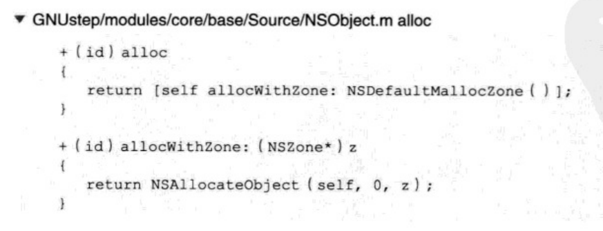
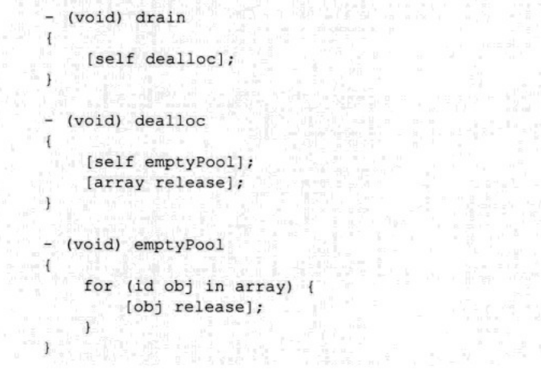

# Objective-c内存管理
objective-c存在ARC(automatic reference counting)和手动引用计数管理两种内存管理方式。
## 手动引用计数
objective-c中每个对象存在一个引用计数，程序员通过生成对象(alloc、new、copy、mutableCopy)，持有对象(retain)，释放对象(release)，废弃对象(dealloc)等操作对引用计数进行管理。

当对象被创建(alloc)出来后，引用计数自动加1，程序员可以通过[object alloc]主动使对象的引用计数加1，并通过[object release]使对象的引用减1。当对象的引用计数变为0的时候，会回调对象的dealloc方法，并通过c语言的free方法回收变量内存。

上述的objective-c内存管理方法，其实并不是objective-c语言的特性，而是包含在ios开发的cocoa框架中。cocoa框架中的Foundation框架类库的NSObject类担任内存管理的职责，其他类通过继承NSObject类获得内存管理的能力。


### 引用计数规范
在objective-c的内存管理，通过以下约定降低内存管理的复杂度。

* 自己生成的对象，自己持有

    使用alloc、new、copy、mutableCopy等名称开头的方法意味着生成的对象只有自己持有。但是也需要自己进行release操作

    ```
    //生成对象
    NSObject obj = [[NSObject alloc] init];

    //手动release
    [obj release];

    //对于希望对象与自己拥有相同的生命周期，可以在dealloc方法中release
    - (void) dealloc {
        [obj release];
        [super dealloc];
    }

    ```
* 非自己生成的对象，自己也能持有

    在使用除alloc、new、copy、mutableCopy方法获得的对象(如[NSMutableArray array])，因为非自己所生成，所以自己不是该对象的持有者，通过retain方法增加引用

    ```
    id obj = [NSMutableArray array];

    [obj retain];
    ```

* 不需要自己持有的对象时释放

    自己持有的对象，一旦不再需要，持有者有义务通过release方法对对象进行释放

    ```
    //id obj = [[NSObject alloc] init];

    id obj = [NSMutableArray array];

    [obj retain];

    [obj release];
    ```

    如果需要提供某个方法生成对象，并返回给该方法的调用方，分为两种情况：自己持有对象、自己不持有对象

    自己持有对象，命名为allocxxx

    ```
    - (id) allocObject {

        id obj = [[NSObject alloc] init];

        return obj;
    }
    ```

    这种情况以alloc命名，说明调用方也持有这个对象，符合上述规则

    自己不持有对象，如[NSMutableArray array]，所以不能以allocxxx命名

    ```
    - (id) object {

        id obj = [[NSObject alloc] init];

        [obj autoRelease];

        return obj;
    }

    ```

    上面使用autoRelease方法。使用这种方法，可以使取得的对象存在，但是自身不持有对象。autoRelease使对象在超出指定的生存范围时能够自动释放

    

* 无法释放非自己持有的对象

    对于使用alloc或是retain方法持有的对象，由于持有者是自己，所以在不需要该对象的时候需要手动将其释放。由此以外得到的对象绝不能手动释放。

    ```
    id obj = [[NSObject alloc] init];

    //对象释放后，自身已经不持有对象
    [obj release];

    //释放非自身持有的对象，可能造成崩溃
    [obj release];
    ```

以上的四个规则是针对objective-c内存管理方式提出的一种规范，其本质是保证对象的引用计数的正确性。

### alloc、retain、release、dealloc的实现
由于Apple的Foundation框架并没有开源，所以NSObject的源码是并没有公开。

GUNStep是cocoa的互换框架，其源代码虽然不能说和Apple的完全一致，但是从使用者的角度来说，两者的行为是一样的。下面用GunStep的源码探索内存管理的实现。

* alloc

    在NSObject中alloc的实现如下：
    
    
    

    alloc方法通过NSZoneMallc方法为对象分配了内存空间，之后将内存空间置0，最好返回对象指针。

    

    以下是去掉了NSZone后简化了的源码：

    

    alloc方法中，使用了sturct obj_layout 中的retained来保存对象的引用计数，并将其写入对象内存地址的头部。

    

* retain

    在NSObject中retain的实现如下：

    

    即通过对象地址找出obj_layout地址并将retained+1

* release

    在NSObject中release的实现如下：

    

    如果retained为0，调用NSObject的dealloc清理对象，否则将retained-1

    

    dealloc使用free方法清除内存

相较于GUNStep将引用计数保存在对象占用内存块的头部变量中，Apple的实现是将引用计数保存在一个全局的Hash表中（引用计数表）


通过内存块头部管理引用计数的好处：

* 少量代码即可实现
* 能够统一管理引用计数的内存块和对象的内存块

通过引用计数表管理引用计数的好处：

* 对象分配内存块无需考虑引用计数的内存块
* 引用计数表中存有内存块地址，可从各个记录追溯到各对象的内存块，在出现故障导致对象占用的内存块损坏时，只要引用计数表没有被破坏，就可以确认各内存块的位置

    

### autorelease

autorelease方法将对象注册到NSAutoreleasePool中，在NSAutoreleasePool被废弃的时候，会调用所有处于池中的对象的release方法废弃对象


使用实例:

```
NSAutoreleasePool *pool = [[NSAutoreleasePool alloc] init];

id obj = [[NSObject alloc] init];

[obj autorelease];

[pool release];

```

在cocoa框架中，程序主循环NSRunLoop对NSAutoreleasePool对象进行生成、持有和废弃。因此开发者可以不手动使用NSAutoreleasePool进行对象内存管理


但是有时候使用了大量的autorelease对象，并且由主循环的NSAutoreleasePool对对象内存进行管理，由于没有主动释放NSAutoreleasePool，会导致内存不足

```
for (int i = 0; i < n; i++) {
    //这里由于没有释放NSAutoreleasePool，而for循环中大量的autorelease对象无法被释放，导致内存不足
    [xx autorelease];
    //大量autorelease对象
}

```

改进的方法时手动对NSAutoreleasePool进行释放

```
for (int i = 0; i < n; i++) {
    NSAutoreleasePool *pool = [[NSAutoreleasePool alloc] init];

    [xx autorelease];
    //大量autorelease对象

    [pool release];
    //pool release后，其他对象也被释放回收
}
```

### autorelease的实现

首先看GUNStep中NSObject的autorelease是如何实现的


调用了NSAutoreleasePool的addObject方法，addObject的简化代码如下：


如果存在嵌套NSAutoreleasePool的情况，会使用最内侧的对象。如下图中，pool2为当前使用的NSAutoreleasePool对象


NSAutoreleasePool的addObject方法的具体就是将引用对象放入一个NSMutableArray中


下面看NSAutoreleasePool的释放方法drain



即调用了array中的所有引用对象的release方法，从而释放所有在引用池中的对象
