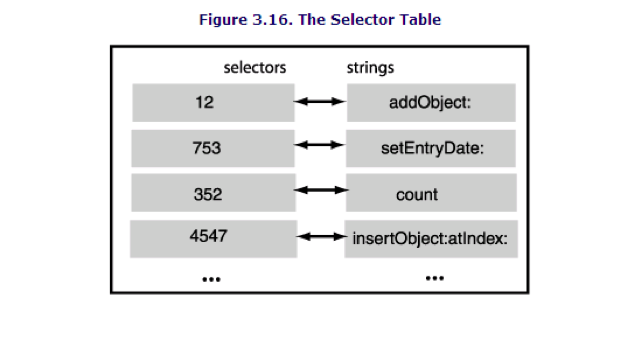
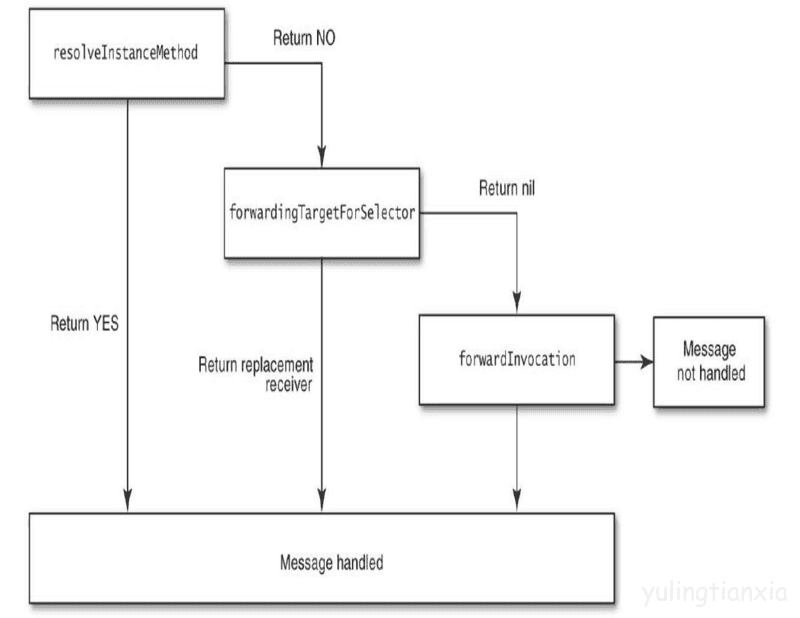
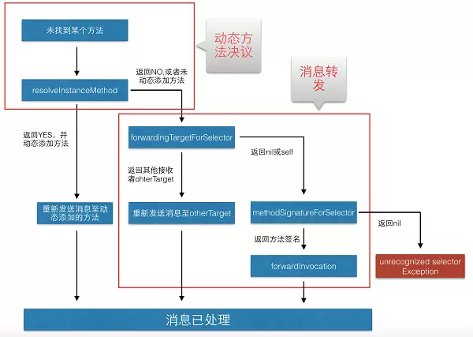
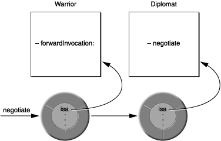

# category 和 extension

## category

category 在不继承类的前提可以给类增加方法（系统类也可以），示例：

```
@interface NSNumber (JamesNSNC)

- (BOOL) isNSString;

@end

@implementation NSNumber (JamesNSNC)

- (BOOL) isNSString {
    return [self isKindOfClass:[NSString class]];
}

@end

```

* Category的方法不一定非要在@implement中实现,也可以在其他位置中实现,但是当调用Category的方法时,依据继承树没有找到该方法的实现,程序则会崩溃;并且,Category的方法优先级较高,可以覆盖原类的方法;

* 在实际开发中要注意的是,Category 方法可能会覆盖于同一个类class 的其它 category 中的方法。但也可能被覆盖，因为不法预知他们的加载优先顺序，出现这种情况通常会在编译时出错。如果在一个开发的SDK中使用了类别， 就最好保证类别名不同于使用者的类别名以及类别方法也不同于使用者的类别方法名， 通常通过加前缀来做到。

* Category理论上不能添加成员变量,但是可以使用@dynamic(即运行时Runtime)来弥补这种不足.

## Category通过Runtime来增加属性

```
#import <Foundation/Foundation.h>

@interface NSNumber (JamesNSNC)

@property (nonatomic, assign) int64_t timeStamp;

@end


#import "NSNumber+JamesNSNC.h"

#import "objc/runtime.h"

@implementation NSNumber (JamesNSNC)

- (int64_t) timeStamp {
    return ((NSNumber *)(objc_getAssociatedObject(self, _cmd))).integerValue;
}

- (void) setTimeStamp:(int64_t)timeStamp {
    objc_setAssociatedObject(self, @selector(timeStamp), @(timeStamp), OBJC_ASSOCIATION_RETAIN_NONATOMIC);
}

@end

```

## extension

* 可以为某个类添加成员变量、属性、方法
* 一般的类扩展写到.m文件中
* 一般的私有属性写到类扩展中

示例：

```
@interface NSObject()

@property (nonatomic) NSString *subString;

@end
```
## category 和 extension 的区别

* Category的小括号中有名字,而Extension没有

* Category只能扩充方法,不能扩充成员变量和属性

* 如果Category声明了声明了一个属性,那么Category只会生成这个属性的set,get方法的声明,也就不是会实现

```
//Category(类别,分类)
@interface myClass (Category)
// 只会生成set,get方法的声明,创建的对象没有name属性.
@property (nonatomic,copy) NSString *name;
@end

// Extension(类扩展)
@interface myClass
// 创建name成员变量,并声明和实现set,get方法
@property (nonatomic,copy) NSString *name;
@end
```

## category 和 extension 在编译和运行时的区别

//todo

# 方法调用

## @selector的介绍

首先熟悉以下概念：

* 方法（函数）：由程序代码构成，是对象的实现的一部分，相对于操作本身重点强调执行操作的方法对于面向对象程序设计很重要，因为不同的对象可能具有执行相同操作的不同方法。

* 消息：让对象执行操作的请求，对象确定将使用哪个方法来执行操作。可以把相同的消息发送给不同的对象，以及产生不同的结果。

* 选择器：确定要发送给对象的消息，并且接受消息的对象将会使用选择器来选择调用哪个方法。

@selector 会先寻找父类的方法，再寻找子类的方法（只根据方法名，oc中函数签名只跟函数的名称有关）。

OC提供了SEL数据类型，用来声明存储选择器的变量

示例：


```
#import <Foundation/Foundation.h>

@interface TestClass : NSObject

- (NSString *) update;

@end

@implementation TestClass

- (NSString *) update {
    return @"update success";
}

@end

int main() {
    
    SEL aSelect = @selector(update);
    
    TestClass *obj = [[TestClass alloc] init];
    
    id result = [obj update];
    
    id result2 = [obj performSelector:aSelect withObject:nil];
    
    id result3 = [obj performSelector:@selector(update) withObject:nil];
    
}
```

可以通过respondsToSelector先验证一个对象是否可以相应此消息：

```
if ([obj respondsToSelector:aSelect]) {
    [obj performSelector:aSelect withObject:nil];
    //[obj update];
}
```

## @selector 原理

首先熟悉两个定义：

* SEL：类成员方法的指针，但不同于C语言中的函数指针，函数指针直接保存了方法的地址，但SEL只是方法编号。

* IMP：一个函数指针,保存了方法的地址。

每一个继承于NSObject的类都能自动获得runtime的支持。在这样一个类中，有一个isa指针，指向该类定义的数据结构体，这个结构体是由编译器编译时为类（继承于NSObject）创建的。在这个结构体中有包括了：指向其父类定义的指针以及Dispatch Table。Dispatch Table是一张SEL和IMP的对应表。



也就是说方法编号SEL最后还是要通过Dispatch table表寻找到对应的IMP，IMP就是一个函数指针，然后执行这个方法。

在编译的时候, 只要有方法的调用, 编译器都会通过 selector 来查找,所以 (假设 addObject 的 selector 为 12)

```
[obj addObject: otherObj];
```

将会被编译成：

```
objc_msgSend(obj, 12, otherObj);
```

这里，objec_msgSend()函数将会使用myObject 的isa 指针来找到myObject的类空间结构并在类空间结构中查找 selector 12 所对应的方法。

如果没有找到，那么将使用指向父类的指针找到父类空间结构进行 selector 12 的查找。

如果仍然没有找到，就继续往父类的父类一直找，直到找到为止， 如果到了根类 NSObject 中仍然找不到，将会抛出异常。

我们可以看到, 这是一个很动态的查找过程。类的结构可以在运行的时候改变,这样可以很容易来进行功能扩展，Objective-C 语言是动态语言, 支持动态绑定。

* 怎么获得方法编号

    通过@selector()取类方法的编号

    ```
    SEL methodId=@selector(func1);
    ```

* 编号取得后怎么执行对应方法

    ```
    [self performSelector: methodId withObject: nil];    
    ```

* 怎么通过编号获取方法名称？

    ```
    NSString *methodName = NSStringFromSelector(methodId);
    ```

* IMP怎么获得和使用？

    ```
    IMP method = [obj methodForSelector:aSelect];
    method();
    ```

## runtime消息转发

runtime消息转发的流程如下，如果当前对象无法响应接受的消息，系统会通过调用resolveInstanceMethod方法依次向下转发消息






**重定向**

在resolveInstanceMethod返回NO的情况下，系统允许消息进行重定向。消息转发机制执行前，Runtime 系统允许我们替换消息的接收者为其他对象。通过 - (id)forwardingTargetForSelector:(SEL)aSelector 方法。

```
- (id)forwardingTargetForSelector:(SEL)aSelector
{
    if(aSelector == @selector(mysteriousMethod:)){
        return alternateObject;
    }
    return [super forwardingTargetForSelector:aSelector];
}
```
如果此方法返回 nil 或者 self，则会进入消息转发机制(forwardInvocation:)，否则将向返回的对象重新发送消息。

**转发**
当动态方法解析不做处理返回 NO 时，则会触发消息转发机制。这时 forwardInvocation: 方法会被执行，我们可以重写这个方法来自定义我们的转发逻辑：

```
- (void)forwardInvocation:(NSInvocation *)anInvocation
{
    if ([someOtherObject respondsToSelector:
            [anInvocation selector]])
        [anInvocation invokeWithTarget:someOtherObject];
    else
        [super forwardInvocation:anInvocation];
}
```

唯一参数是个 NSInvocation 类型的对象，该对象封装了原始的消息和消息的参数。我们可以实现 forwardInvocation: 方法来对不能处理的消息做一些处理。也可以将消息转发给其他对象处理，而不抛出错误。

**anInvocation参数**

在 forwardInvocation: 消息发送前，Runtime 系统会向对象发送methodSignatureForSelector: 消息，并取到返回的方法签名用于生成 NSInvocation 对象。所以重写 forwardInvocation: 的同时也要重写 methodSignatureForSelector: 方法，否则会抛异常。

当一个对象由于没有相应的方法实现而无法响应某消息时，运行时系统将通过 forwardInvocation: 消息通知该对象。每个对象都继承了 forwardInvocation: 方法。但是， NSObject 中的方法实现只是简单的调用了 doesNotRecognizeSelector:。通过实现自己的 forwardInvocation: 方法，我们可以将消息转发给其他对象。

forwardInvocation: 方法就是一个不能识别消息的分发中心，将这些不能识别的消息转发给不同的接收对象，或者转发给同一个对象，再或者将消息翻译成另外的消息，亦或者简单的“吃掉”某些消息，因此没有响应也不会报错。这一切都取决于方法的具体实现。

**转发和多继承**

转发和继承相似，可用于为 Objc 编程添加一些多继承的效果。就像下图那样，一个对象把消息转发出去，就好像它把另一个对象中的方法接过来或者“继承”过来一样。



这使得在不同继承体系分支下的两个类可以实现“继承”对方的方法，在上图中 Warrior 和 Diplomat 没有继承关系，但是 Warrior 将 negotiate 消息转发给了 Diplomat 后，就好似 Diplomat 是 Warrior 的超类一样。

消息转发弥补了 Objc 不支持多继承的性质，也避免了因为多继承导致单个类变得臃肿复杂。

## NSProxy

NSProxy是一个抽象超类，同时也是唯一一个不继承于NSObject的类


